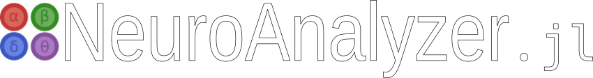

# NeuroRecorder.jl

Available modules:

- **Finger Tapping Test** (FTT) -- using computer keyboard or external panel attached to Raspberry Pi
- **Two-point Pinch Test** (TPT) -- using finger-worn accelerator attached to Raspberry Pi
- **Electrodermal Activity** (EDA) = Galvanic Skin Response (GSR) -- via Raspberry Pi
- **Angular Velocity Sensors** (AVS) -- via Raspberry Pi