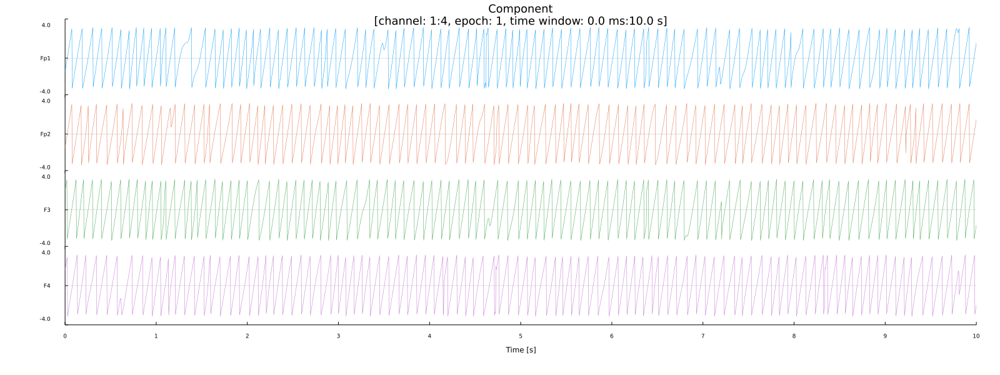
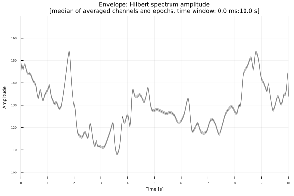
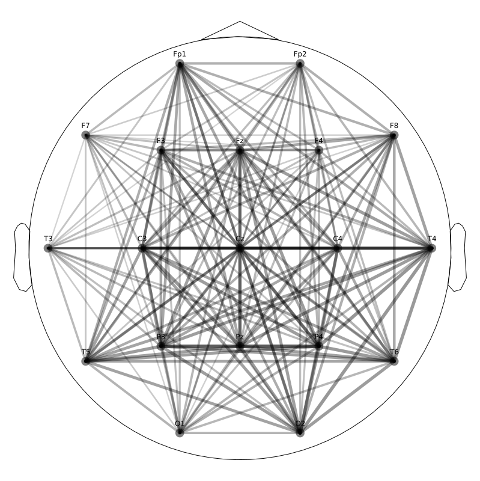
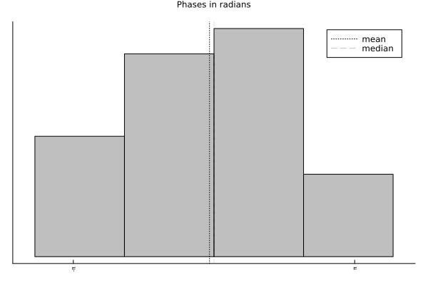
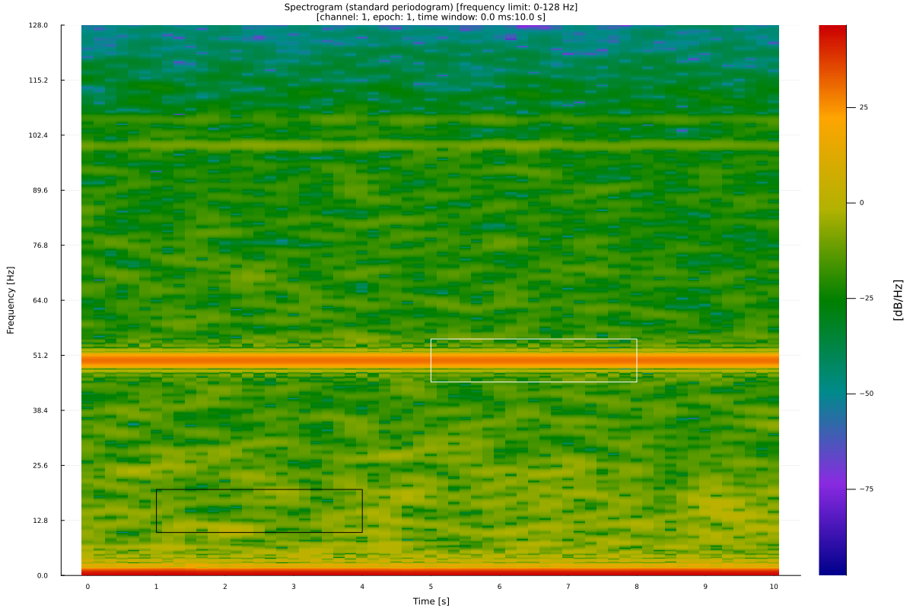
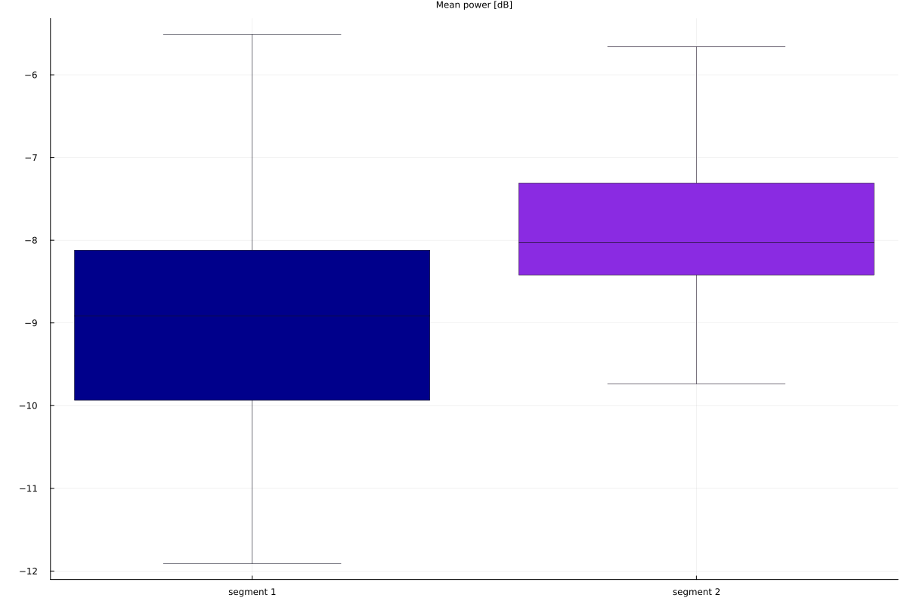

# Neuro.jl Tutorial

View markers:
```julia
eeg_view_marker(eeg)
```
### EEG Analyze

### EEG Plots

Plot filter response:
```julia
p = plot_filter_response(fs=eeg_sr(eeg), fprototype=:butterworth, ftype=:bs, cutoff=(45, 55), order=8)
eeg_plot_save(p, file_name="images/butter_bs_45-55_8.png")
```


Plot band power:
```julia
using DSP
bands = [:delta, :theta, :alpha, :beta]
frq = Vector{Tuple{Float64, Float64}}()
for idx in bands
    push!(frq, eeg_band(eeg, band=idx))
end
bp = Vector{Float64}()
for idx in frq
    push!(bp, pow2db.(eeg_band_power(eeg, f=idx))[1])
end
p = eeg_plot_stats(eeg, bp, epoch=1, channel=1, plot_by=:labels, labels=string.(bands), type=:bar, xlabel="", ylabel="Power [dB]", title="Band powers\n[epoch: 1, channel: 1 ($(eeg_labels(eeg)[1]))]")
eeg_plot_save(p, file_name="images/eeg_bands.png")
```


Plot PSD relative to alpha band power:
```julia
p = eeg_plot_psd(eeg, epoch=1, channel=1, ref=:alpha)
eeg_plot_save(p, file_name="images/eeg_rel_psd.png")
```


Plot phase of the convoluted signal:
```julia
mw = generate_morlet(256, 10, 32, complex=true)
e10_tconv = eeg_tconv(e10, kernel=mw)
pt = s_phases(e10_tconv)
p = eeg_plot(e10, pt, epoch=1, c_idx=1:4, scale=false, emarkers=false)
eeg_plot_save(p, file_name="images/e10_tconv_phases.png")
```


Topographical plot:
```julia
p = eeg_plot_topo(eeg, segment=(1, 2560))
eeg_plot_save(p, file_name="images/eeg_amp.png")
```


Topographical plots:
```
p1 = eeg_plot_topo(eeg, segment=(1, 2560), title="0:1s", cb=false)
p2 = eeg_plot_topo(eeg, segment=(1 * 256 + 1, 2 * 2560), title="1:2s", cb=false)
p3 = eeg_plot_topo(eeg, segment=(2 * 256 + 1, 3 * 2560), title="2:3s", cb=false)
p4 = eeg_plot_topo(eeg, segment=(3 * 256 + 1, 4 * 2560), title="3:4s", cb=false)
p = plot(p1, p2, p3, p4, layout=(2, 2))
eeg_plot_save(p, file_name="images/eeg_topos.png")
```


Topographical map of PSD
```julia
p = eeg_plot_psd(eeg, channel=1:19, epoch=1, frq_lim=(0, 8), mt=true, variant=:topo)
eeg_plot_save(p, file_name="images/eeg_psd_topo.png")
```


Plot PCA components:
```julia
pc, pc_m, pc_var = eeg_pca(eeg, n=10)
p = eeg_plot(eeg, channel=1:5, segment=(10*eeg_sr(eeg), 20*eeg_sr(eeg)))
eeg_plot_save(p, file_name="images/eeg_1_5.png")
p = eeg_plot(eeg, pc, c_idx=1:5, segment=(10*eeg_sr(eeg), 20*eeg_sr(eeg)))
eeg_plot_save(p, file_name="images/eeg_pca_1_5.png")
bar(vec(pc_var))
```


Plot ICA components:
```julia
ic, icm = eeg_ica(eeg, n=16, tol=0.99)
p = eeg_plot(eeg, ic, c_idx=1:10, epoch=1)
eeg_plot_save(p, file_name="images/eeg_ica_1_10.png")
```


```julia
ic, icm = eeg_ica(eeg, n=16, tol=0.99)
eeg_add_component!(eeg, c=:ica, v=ic)
eeg_add_component!(eeg, c=:ica_mw, v=icm)
# reconstruct signal using ICA 1:10
s_reconstructed = s_ica_reconstruct(eeg.eeg_signals, ic=ic, ic_mw=icm, ic_v=1:10)
p1 = eeg_plot_topo(eeg, epoch=1, title="Original signal", cb=false)
p2 = eeg_plot_topo(eeg, s_reconstructed, epoch=1, title="Signal reconstructed from ICA 1:10", cb=false)
p = plot(p1, p2)
eeg_plot_save(p, file_name="images/eeg_ica_1_10.png")
```


Plot alpha band power:
```julia
alpha_power = eeg_band_power(eeg, f=eeg_band(eeg, band=:alpha))
p = eeg_plot_topo(eeg, alpha_power)
eeg_plot_save(p, file_name="images/eeg_alpha_topo.png")
```


Plot phase difference at time = 1s (sample = 256 as fs = 256 Hz)
```julia
pdiff = eeg_phdiff(eeg)
p = eeg_plot_topo(eeg, pdiff[:, 256, :])
eeg_plot_save(p, file_name="images/eeg_phdiff_topo.png")
```


Plot amp difference at time = 1s (sample = 256 as fs = 256 Hz)
```julia
ampdiff = eeg_ampdiff(eeg)
p = eeg_plot_topo(eeg, ampdiff[:, 256, :], epoch=1)
eeg_plot_save(p, file_name="images/eeg_ampdiff_topo.png")
```


Plot weights:
```julia
w = (1:19) * 0.05
p = plot_weights(eeg.eeg_locs, channel=1:19, weights=round.(w, digits=2), head_labels=false)
eeg_plot_save(p, file_name="images/eeg_weights.png")
```


Plot covariance matrix:
```julia
eeg_cov = eeg_cov(eeg)
p = plot_matrix(eeg_cov[:, :, 1], title="Covariance matrix", labels_x=eeg_labels(eeg)[1:19], labels_y=eeg_labels(eeg)[1:19])
eeg_plot_save(p, file_name="images/eeg_cov.png")
```


Plot auto-covariance matrix:
```julia
ac, lags = eeg_acov(eeg, lag=5, norm=false)
p = plot_covmatrix(ac[1, :, 1], lags, xlabel="", title=eeg_labels(eeg)[eeg_get_channel_bytype(eeg, type=Symbol(eeg.eeg_header[:signal_type]))][1])
eeg_plot_save(p, file_name="images/eeg_autocov.png")
```


Plot cross-covariance matrix:
```julia
xc, lags = eeg_xcov(eeg, lag=5, norm=false)
p = plot_covmatrix(xc[2, :, 1], lags, xlabel="", title="Fp1-Fp2")
eeg_plot_save(p, file_name="images/eeg_xcov.png")
```


Plot channels stats:
```julia
c = eeg_channels_stats(eeg)
e = eeg_epoch_stats(eeg)
eeg_add_component!(eeg, c=:channels_var, v=c[4])
eeg_add_component!(eeg, c=:epochs_var, v=e[4])
p = eeg_plot_stats(eeg, :channels_var, epoch=1, title="Channels variance\n[epoch: 1]", plot_by=:channels, type=:line)
eeg_plot_save(p, file_name="images/eeg_channels.png")
p = eeg_plot_stats(eeg, :epochs_var, epoch=1:10, title="Epochs 1:10 variance", plot_by=:epochs, type=:line)
eeg_plot_save(p, file_name="images/e10_epochs.png")
```


Envelopes:
```julia
p = eeg_plot_signal_psd(e10, epoch=1, channel=1)
eeg_plot_save(p, file_name="images/e10_psd.png")

p = eeg_plot_env(e10, type=:pow, average=:mean, dims=1, epoch=1, channel=1)
eeg_plot_save(p, file_name="images/e10_penv.png")

p = eeg_plot_signal_spectrogram(e10, epoch=1, channel=1, frq_lim=(0,10))
eeg_plot_save(p, file_name="images/e10_spec.png")

p = eeg_plot_env(e10, type=:spec, average=:median, epoch=1, channel=1, dims=3, frq_lim=(0,10))
eeg_plot_save(p, file_name="images/e10_senv.png")

p = eeg_plot_env(e10, type=:hamp, average=:median, epoch=1, channel=1, dims=3)
eeg_plot_save(p, file_name="images/e10_henv.png")
```




ISPC:
```julia
p = eeg_plot_ispc(e10, e10, channel1=1, channel2=2, epoch1=1, epoch2=1)
eeg_plot_save(p, file_name="images/e10_ispc.png")
m = eeg_ispc(e10)
p = plot_matrix(m[:, :, 1], labels_x=eeg_labels(e10), labels_y=eeg_labels(e10))
eeg_plot_save(p, file_name="images/e10_ispc_m.png")
p = eeg_plot_connections(e10, m=m[:, :, 1], threshold=0.90, threshold_type=:geq)
eeg_plot_save(p, file_name="images/e10_ispc_connections.png")
```


ITPC:
```julia
p = eeg_plot_itpc(e10, channel=1, t=256)
eeg_plot_save(p, file_name="images/e10_itpc.png")
p = eeg_plot_itpc_s(e10, channel=1, frq_lim=(1, 20), frq_n=20)
eeg_plot_save(p, file_name="images/e10_itpc_s.png")
i, f = eeg_itpc_s(e10, channel=1, frq_lim=(1, 20), frq_n=20)
# plot ITCP at 4 Hz frequency over epoch time
eeg_plot_itpc_f(e10, channel=1, frq_lim=(0, 10), frq_n=10, f=4, frq=:lin)
```


PLI:
```julia
p = eeg_pli(e10, e10, channel1=1, channel2=2, epoch1=1, epoch2=1)
p1 = eeg_plot(e10, segment=(1, 256), channel=1:2, variant=:butterfly, title="Signals")
p2 = eeg_plot(e10, p.signal_diff, segment=(1, 256), title="Signals difference [μV]", scale=false)
p3 = eeg_plot(e10, [p.s1_phase; p.s2_phase], segment=(1, 256), channel=1:2, variant=:butterfly, title="Phases [rad]")
p4 = eeg_plot(e10, p.phase_dif, segment=(1, 256), channel=1:2, title="Phases difference [rad]", scale=false)
p5 = eeg_plot_stats(e10, hcat(p.s1_phase[1, :, 1], ones(length(p.s1_phase[:, :, 1]))), plot_by=:channels, channel=1:2, type=:polar, title="Phases")
p6 = eeg_plot_stats(e10, hcat(p.phase_dif[1, :, 1], ones(length(p.s1_phase[:, :, 1]))), plot_by=:channels, channel=1:2, type=:polar, title="Phases difference and PLI = $(p.pli[1])")
p = plot(p1, p2, p3, p4, p5, p6, layout=(3, 2))
eeg_plot_save(p, file_name="images/e10_pli.png")

m = eeg_pli(e10)
p = plot_matrix(m[:, :, 1], labels_x=eeg_labels(e10), labels_y=eeg_labels(e10))
eeg_plot_save(p, file_name="images/e10_pli_m.png")
```


Connections based on Hilbert transform amplitude envelope:
```julia
h, t = eeg_henv(eeg)
m = zeros(size(h, 1), size(h, 1))
for idx1 in 1:size(h, 1)
    for idx2 in 1:size(h, 1)
        c = s2_cor(h[idx1, :, 1], h[idx2, :, 1])
        m[idx1, idx2] = c.r
    end
end
p = eeg_plot_connections(eeg, m=m, threshold=0.2, threshold_type=:geq)
eeg_plot_save(p, file_name="images/h_connections.png")
```


Animate:
```julia
anim = @animate for i ∈ 1::10:2*eeg_sr(eeg)
    eeg_plot_topo(eeg, segment=(2560 + i, 2560 + i + 1), channel=1:19)
end
gif(anim, "/tmp/anim_fps15.gif", fps = 15)
```

Using kwargs:
```julia
c = rand(-pi:0.01:pi, 100)
p = eeg_plot_stats(eeg, c, plot_by=:epochs, epoch=1, type=:hist)
p = plot!(title="Phases in radians", xticks=([-pi, pi], ["-π", "π"]))
eeg_plot_save(p, file_name="images/kwargs.png")
```



### Statistics

Comparing two signals:
```julia
eeg1 = eeg_filter(eeg, fprototype=:butterworth, ftype=:bp, cutoff=eeg_band(eeg, band=:delta), order=8)
eeg1 = eeg_epoch(eeg1, epoch_len=10*eeg_sr(eeg1))
eeg_erp!(eeg1)
eeg1 = eeg_keep_channel(eeg1, 4)
eeg2 = eeg_filter(eeg, fprototype=:butterworth, ftype=:bp, cutoff=eeg_band(eeg, band=:beta), order=8)
eeg2 = eeg_epoch(eeg2, epoch_len=10*eeg_sr(eeg2))
eeg_erp!(eeg2)
eeg2 = eeg_keep_channel(eeg2, 4)
s, ss, p = eeg_difference(eeg1, eeg2, n=10, method=:absdiff)
s, ss, p = eeg_difference(eeg1, eeg2, n=10, method=:diff2int)
# the distribution of bootstrapped signal statistic
histogram(s)
# statistic for signal1 and signal2
vline!([ss])
# how many % of bootstrapped signal statistic are > statistic for signal1 and signal2
ss
# if p < alpha → signals are different
p
```

Generate spectrogram segments:
```julia
sp, sf, st = eeg_spectrogram(e10) 
segp1, segs1, tidx1, fidx1 = s_specseg(sp, st, sf, channel=1, t=(1.0, 4.0), f=(10.0, 20.0))
segp2, segs2, tidx2, fidx2 = s_specseg(sp, st, sf, channel=1, t=(5.0, 8.0), f=(45.0, 55.0))

p = eeg_plot_spectrogram(e10, channel=1, epoch=1)
p = plot!(segs1, lc=:black, fill=nothing, label=false)
p = plot!(segs2, lc=:white, fill=nothing, label=false)
eeg_plot_save(p, file_name="images/spec_seg.png")

segp1 = seg_mean(segp1)
segp2 = seg_mean(segp2)
tt, t, c, df, p = s2_cmp(segp1, segp2, paired=true, type=:p);
println("segment 1: mean $(round(mean(segp1), digits=2)), sd $(round(std(segp1), digits=2))")
println("segment 2: mean $(round(mean(segp2), digits=2)), sd $(round(std(segp2), digits=2))")
println("test statistic $(t[2]): $(t[1]) (df = $df), p: $p")
p = boxplot([segp1, segp1], xticks=([1, 2], ["segment 1", "segment 2"]), legend=false, outliers=false)
segp = _labeled_matrix2dict(["segment 1", "segment 2"], [segp1, segp2])
p = eeg_plot_stats(e10, segp, plot_by=:labels, type=:box, title="Mean power [dB]", outliers=false)
eeg_plot_save(p, file_name="images/spec_seg_box.png")
```


