# Neuro.jl Tutorial

## Start NeuroJ.jl

For interactive processing it's best to use Pluto:
```julia
import Pluto
Pluto.run()
```

Load package:
```julia
using NeuroJ
```

Show version (for reproducibility):
```julia
neuroj_version()
```

Get help:
```julia
?eeg_plot_signal
```

## EEG

The tutorial is divided into five major steps of typical pipeline:
1. import EEG data, electrode positions
2. edit EEG (e.g. rename labels, trim signal, detect and remove/interpolate bad channels, divide into epochs)
3. process EEG (rereference, filter)
4. analyze
5. plot

### EEG IO

Load EDF file:
```julia
edf = eeg_import_edf("test/eeg-test-edf.edf")
```

Load electrode positions (CED, LOCS and ELC formats are supported):
```julia
eeg_load_electrodes!(edf, file_name="locs/standard-10-20-cap19-elmiko.ced")
p = eeg_plot_electrodes(edf, labels=true, head=true, selected=1:19, size=(400, 400))
eeg_plot_save(p, file_name="images/edf_electrodes.png")
```

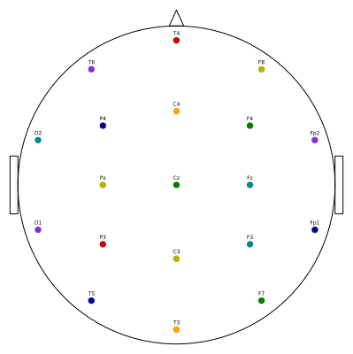

Save EEG object as HDF5-based file:
```julia
eeg_save(edf, file_name="test.bin", overwrite=true)
```

Load EEG object:
```julia
edf = eeg_load("test.bin")
```

Export EEG data, header and components to .csv:
```julia
eeg_export_csv(edf, file_name="edf.csv", header=true, components=true)
```

### EEG Edit

Remove EEG from memory:
```julia
edf = nothing
```

Copy EEG:
```julia
edf_tmp = eeg_copy(edf)
```
Do not use `edf_tmp = edf` as all operations on `edf_tmp` will also affect `edf`.

All operations on EEG are stored within the object. Show processing history:
```julia
eeg_history(edf)
```

Edit EEG header:
```julia
eeg_show_header(edf)
eeg_edit_header!(edf, field=:patient, value="N.N.")
eeg_edit_header!(edf, field=:comment, value="This is a tutorial EEG dataset.")
```

Show EEG properties:
```julia
eeg_info(edf)
eeg_sr(edf)
eeg_channel_n(edf)
eeg_epoch_n(edf)
eeg_signal_len(edf)
eeg_epoch_len(edf)
```

Any metadata can be extracted via `eeg_header`:
```julia
edf.eeg_header[:eeg_duration_seconds]
```

Show labels:
```julia
eeg_labels(edf)
```

Show comment:
```julia
eeg_comment(edf)
```

Get channel (by name or number):
```julia
eeg_get_channel(edf, channel="Cz")
eeg_get_channel(edf, channel=18)
```

Rename channels:
```julia
edf = eeg_rename_channel(edf, channel="Cz", new_name="CZ")
eeg_rename_channel!(edf, channel=18, new_name="Cz")
```

Delete channels (epochs and channels may be specified using number, range or vector):
```julia
edf = eeg_delete_channel(edf, channel=1)
edf = eeg_delete_channel(edf, channel=10:18)
edf = eeg_delete_channel(edf, channel=[1, 5, 9])
```

Keep channel:
```julia
edf = eeg_keep_channel(edf, channel=1:4)
```

Remove parts of the signal (all lengths are in samples, use `eeg_t2s()` or `time * sampling rate` to convert time to samples):
```julia
edf = eeg_trim(edf, len=(10*eeg_sr(edf)), from=:start)
edf = eeg_trim(edf, len=(10*eeg_sr(edf)), offset=(10*eeg_sr(edf)), from=:start)
eeg_trim!(edf, len=(10*eeg_sr(edf)), from=:end)
```

Split into 10-second epochs:
```julia
e10 = eeg_epochs(edf, epoch_len=10*eeg_sr(edf))
```

Trim 1 second from each epoch:
```julia
e9 = eeg_trim(e10, trim_len=(1*eeg_sr(e10)), from=:start)
eeg_plot(e9, len=60*eeg_sr(e9), offset=0)
```

Get 1st epoch:
```julia
e10e1 = eeg_extract_epoch(e10, epoch=1)
eeg_info(e10e1)
```

Delete epochs:
```julia
e = eeg_delete_epoch(e10, epoch=8:10)
```

Keep epochs:
```julia
e1 = eeg_keep_epoch(e, epoch=[1, 3, 5, 9])
```

Split into 5-second averaged epoch
```julia
e2avg = eeg_epochs(edf, epoch_len=5*eeg_sr(edf), average=true)
eeg_info(e2avg)
```

Detect bad epochs:
```julia
bad_epochs = eeg_detect_bad_epochs(e10, method=[:flat, :cor], r=0.7)
eeg_check_bad_epochs(e10, bad_epochs)
eeg_delete_epoch!(e10, epoch=bad_epochs)
```

### EEG Process

Any analysis data (e.g. ICA, PCA) can be stored within the EEG object (see `eeg_add_component()`, `eeg_delete_component()`, `eeg_rename_component()`, `eeg_component_type()`) for later use (see `eeg_extract_component()`). Note: any function that changes EEG signal data (e.g. channel removal, filtering) resets embedded components (see `eeg_reset_components()`.

Show components (e.g. ICA, PCA):
```julia
eeg_list_components(edf)
```

Add component:
```julia
e = eeg_epochs_stats(edf)
eeg_add_component!(edf, c=:epoch_mean, v=e[1])
```

Get component type:
```julia
eeg_component_type(edf, c=:epoch_mean)
```

Get component content:
```julia
eeg_extract_component(edf, c=:epoch_mean)
```

Delete component:
```julia
edf = eeg_delete_component(edf, c=:ica)
eeg_delete_component!(edf, c=:ica)
eeg_reset_components!(edf)
```

Resample:
```julia
eeg_sr(edf)
edf_512 = eeg_resample(edf, new_sr=512)
edf_128 = eeg_rewnsample(edf, new_sr=128)
```

Re-reference to channel(s) - if more than one channel is used as reference, the average of these channels is used:
```julia
edf = eeg_reference_ch(edf, channel=[1, 2])
edf = eeg_reference_ch(edf, channel=2:4)
edf = eeg_reference_ch(edf, channel=18)
```

Re-reference to common average:
```julia
eeg_reference_car!(edf)
# do not include current electrode and Fp1, Fp2, O1 and O2 when calculating common average
eeg_reference_car!(edf, exclude_fpo=true, exclude_current=true)
```

Re-reference to ipsilateral auricular electrodes:
```julia
eeg_reference_a!(edf, type=:i)
```

Re-reference to contralateral mastoid electrodes:
```julia
eeg_reference_m!(edf, type=:c)
```

FIR filtering:
```julia
eeg_filter!(edf, fprototype=:fir, ftype=:bs, cutoff=(45, 55), order=8, window=hanning(128))
eeg_filter!(edf, fprototype=:fir, ftype=:lp, cutoff=45.0, order=8, window=hanning(128))
eeg_filter!(edf, fprototype=:fir, ftype=:hp, cutoff=0.1, order=8, window=hanning(128))
```

IIR filtering:
```julia
eeg_filter!(edf, fprototype=:butterworth, ftype=:lp, cutoff=45.0, order=8)
eeg_filter!(edf, fprototype=:butterworth, ftype=:hp, cutoff=0.1, order=8)
eeg_filter!(edf, fprototype=:butterworth, ftype=:bs, cutoff=(45, 55), order=8)
eeg_filter!(edf, fprototype=:elliptic, ftype=:bs, cutoff=(45, 55), rs=10, rp=1, order=12)
eeg_filter!(edf, fprototype=:chebyshev1, ftype=:bs, cutoff=(45, 55), rs=1, order=8)
eeg_filter!(edf, fprototype=:chebyshev2, ftype=:bs, cutoff=(45, 55), rp=1, order=8)
```

IIRNOTCH filter:
```julia
eeg_filter!(edf, fprototype=:iirnotch, cutoff=50, bw=2)
```

Remez filter:
```julia
eeg_filter!(edf, fprototype=:remez, ftype=:lp, order=128, cutoff=20, bw=0.5)
```

Normalize:
```julia
eeg_norm_zscore(edf)
eeg_norm_minmax(edf)
eeg_norm_zscore!(edf)
eeg_norm_minmax!(edf)
```

Remove DC:
```julia
eeg_demean(edf)
eeg_demean!(edf)
```

Taper:
```julia
h = hann(edf.eeg_header[:epoch_duration_samples])
eeg_taper(edf, taper=h)
eeg_taper!(edf, taper=h)
```

Calculate signal derivative:
```julia
eeg_derivative(edf)
eeg_derivative!(edf)
```

Detrend:
```julia
eeg_detrend(edf, type=:linear)
eeg_detrend!(edf, type=:constant)
```

Time-domain convolution:
```julia
mw = generate_morlet(256, 1, 32, complex=true)
eeg_tconv(e10, kernel=mw)
eeg_tconv!(e10, kernel=mw)
```

Frequency-domain convolution:
```julia
mw = generate_morlet(256, 1, 32, complex=true)
eeg_fconv(e10, kernel=mw)
eeg_fconv!(e10, kernel=mw)
```

### EEG Analyze

Channels stats:
```julia
eeg_channels_stats(edf)
```

Calculate signal total power:
```julia
eeg_total_power(edf)
```

Calculate band power:
```julia
eeg_band_power(edf, f=(8, 12.5))
```

Calculate covariance matrix:
```julia
eeg_cov(edf)
```

Calculate correlation matrix
```julia
eeg_cor(edf)
```

Calculate auto-covariance:
```julia
eeg_autocov(edf, lag=20, norm=false)
```

Calculate cross-covariance:
```julia
cc, lags = eeg_crosscov(edf, lag=20, demean=true)
# channel by channel, all combinations
plot(lags, cc[1, :])

edf1 = eeg_filter(edf, fprototype=:butterworth, ftype=:bs, cutoff=(45, 55), order=8)
edf2 = eeg_filter(edf, fprototype=:butterworth, ftype=:bs, cutoff=(45, 55), order=12)
cc, lags = eeg_crosscov(edf1, edf2, lag=20, demean=true, norm=true)
plot(lags, cc[1, :])
```

Stationarity:
```julia
p = eeg_stationarity(edf, method=:mean)
p = eeg_stationarity(edf, method=:var)
plot(p[1, :, :], legend=false)
eeg_stationarity!(edf, method=:var)

p = eeg_stationarity(edf, method=:hilbert)
signal_mi(p[1, :, 1], p[2, :, 1])
m = eeg_mi(edf)
eeg_plot_matrix(edf, m)

plot(p[1, :, :], ylims=(-10, 10), legend=false)
p = eeg_stationarity(edf, window=100, method=:euclid)
plot(p[10:end])
```

Entropy:
```julia
e = eeg_entropy(edf)
plot(eeg_labels(edf), e, seriestype=:bar)
```

Coherence over time:
```julia
c, ic = eeg_tcoherence(edf1, edf2)
plot(c[2, 1:2560])
plot(ic[2, 1:2560])

edf_alpha = eeg_filter(edf, fprototype=:butterworth, ftype=:bp, cutoff=eeg_band(edf, band=:alpha), order=8)
eeg_labels(edf_alpha)
# O1 vs O2
c, ic = eeg_tcoherence(edf_alpha, channel1=9, channel2=10, epoch1=1, epoch2=1)
plot(c[1:2560])
plot(ic[1:2560])
```

Coherence over frequencies:
```julia
c, f = eeg_fcoherence(edf1, edf2)
plot(f[1:2560], c[1, 2, 1:2560])

# O1 vs O2, alpha range
c, f = eeg_fcoherence(edf_alpha, channel1=9, channel2=10, epoch1=1, epoch2=1, frq_lim=eeg_band(edf, band=:alpha))
plot(f, c)
```

Generate PCA:
```julia
pc, pc_m, pc_var = eeg_pca(edf, n=4)
```

Generate ICAs:
```julia
i, i_mw = eeg_ica(edf, n=15, tol=1.0)
```

Remove ICA #001 component from the signal:
```julia
eeg_ica_reconstruct!(edf, ic=1)
```

Remove ICA #001-007 component from the signal:
```julia
eeg_ica_reconstruct!(edf, ic=1:7)
```

Remove ICA #001, 003 and 007 component from the signal:
```julia
eeg_ica_reconstruct!(edf, ic=[1, 3, 7])
```

Comparing two signals:
```julia
edf1 = eeg_filter(edf, fprototype=:butterworth, ftype=:bp, cutoff=eeg_band(edf, band=:delta), order=8)
edf1 = eeg_epochs(edf1, epoch_len=10*eeg_sr(edf1), average=true)
edf1 = eeg_keep_channel(edf1, 4)
edf2 = eeg_filter(edf, fprototype=:butterworth, ftype=:bp, cutoff=eeg_band(edf, band=:beta), order=8)
edf2 = eeg_epochs(edf2, epoch_len=10*eeg_sr(edf2), average=true)
edf2 = eeg_keep_channel(edf2, 4)
s, ss, p = eeg_difference(edf1, edf2, n=10, method=:absdiff)
s, ss, p = eeg_difference(edf1, edf2, n=10, method=:diff2int)
# the distribution of bootstrapped signal statistic
histogram(s)
# statistic for signal1 and signal2
vline!([ss])
# how many % of bootstrapped signal statistic are > statistic for signal1 and signal2
ss
# if p < alpha → signals are different
p
```

Signal stats:
```julia
m, s, v = eeg_epochs_stats(edf)
bar(v)
```

ISPC:
```julia
e10 = eeg_epochs(edf, epoch_len=10*256)
i, _, _, _, _, _ = eeg_ispc(e10, e10, channel1=1, channel2=2, epoch1=1, epoch2=1)
```

PLI:
```julia
e10 = eeg_epochs(edf, epoch_len=10*256)
p, _, _, _, _ = eeg_pli(e10, e10, channel1=1, channel2=2, epoch1=1, epoch2=1)
```

Amplitude Envelope Correlation:
```julia
aec, aec_p = eeg_aec(e10, e10, channel1=3, channel2=4, epoch1=10, epoch2=10)
```

### EEG Plotss

Plot multi-channel:
```julia
p = eeg_plot_signal(edf, scaled=false)
eeg_plot_save(p, file_name="images/edf_channels.png")
p = eeg_plot_signal(edf, scaled=true)
eeg_plot_save(p, file_name="images/edf_channels-2.png")
eeg_load_electrodes!(edf, file_name="locs/standard-10-20-cap19-elmiko.ced")
p = eeg_plot_electrodes(edf, selected=1:19, labels=true)
eeg_plot_save(p, file_name="images/edf_electrodes.png")
```

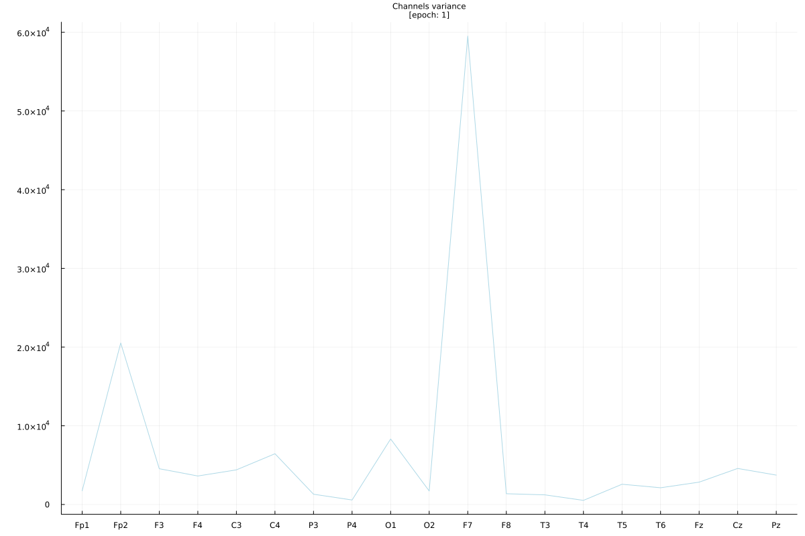

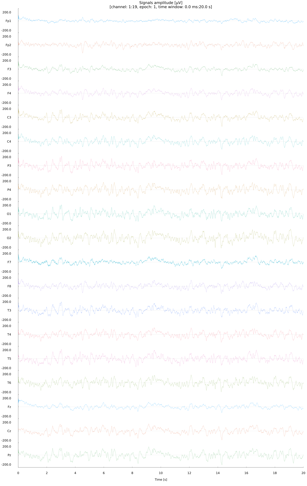


Plot single-channel:
```julia
p = eeg_plot_signal(edf, channel=1)
eeg_plot_save(p, file_name="images/edf_channel_1_simple.png")
p = eeg_plot_signal_details(edf, channel=1, frq_lim=(0, 20))
eeg_plot_save(p, file_name="images/edf_channel_1.png")
```

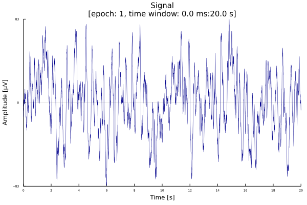

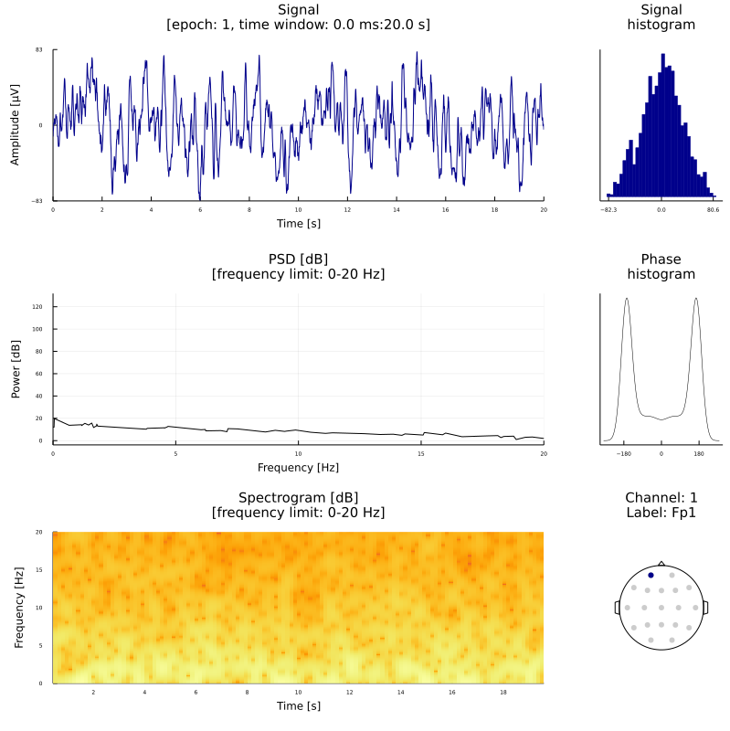

Plot averaged signal:
```juia
p = eeg_plot_signal_avg(edf, channel=1:4)
eeg_plot_save(p, file_name="images/edf_avg_simple.png")
p = eeg_plot_signal_avg_details(edf, frq_lim=(0, 20), channel=1:4)
eeg_plot_save(p, file_name="images/edf_avg.png")
```

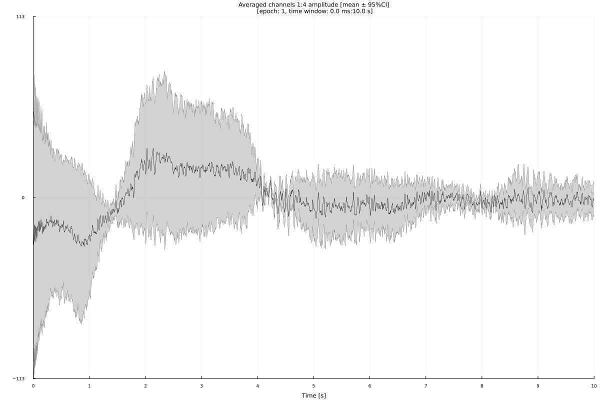


```julia
p = eeg_plot_signal_butterfly(edf)
eeg_plot_save(p, file_name="images/edf_butterfly_simple.png")
p = eeg_plot_signal_butterfly_details(edf)
eeg_plot_save(p, file_name="images/edf_butterfly.png")
```

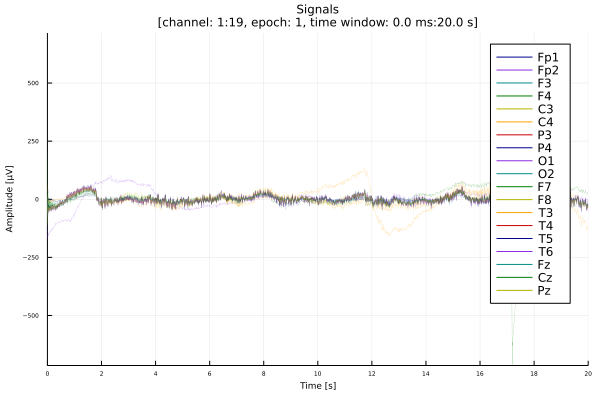

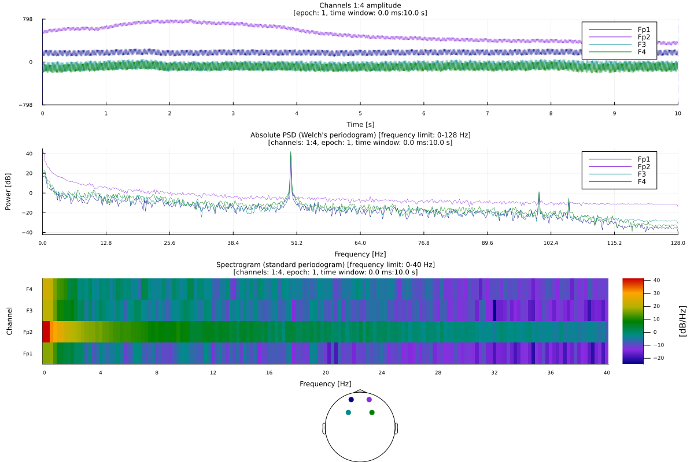

3D water-plot PSD:
```julia
p = eeg_plot_signal_psd_3d(edf, channel=1:5, offset=25600, mt=true)
eeg_plot_save(p, file_name="images/edf_psd3d.png")
```

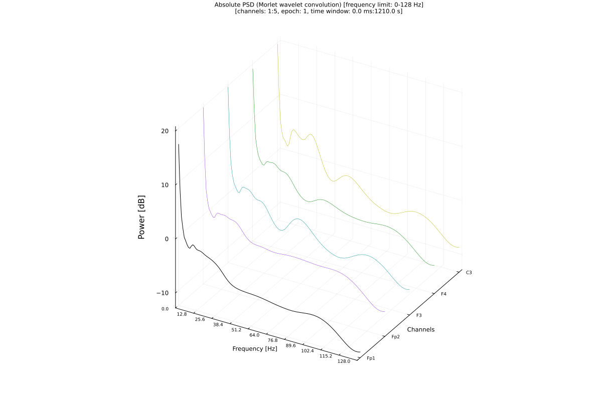

Use kwargs:
```julia
p1 = eeg_plot(edf, title="edf1")
p2 = eeg_plot(edf)
# or modify plots
p2 = plot!(title="edf2")
plot(p1, p2, layout=(1, 2))
```

Plot filter response:
```julia
p = eeg_plot_filter_response(edf, fprototype=:butterworth, ftype=:bs, cutoff=(45, 55), order=8)
eeg_plot_save(p, file_name="images/butter_bs_45-55_8.png")
```

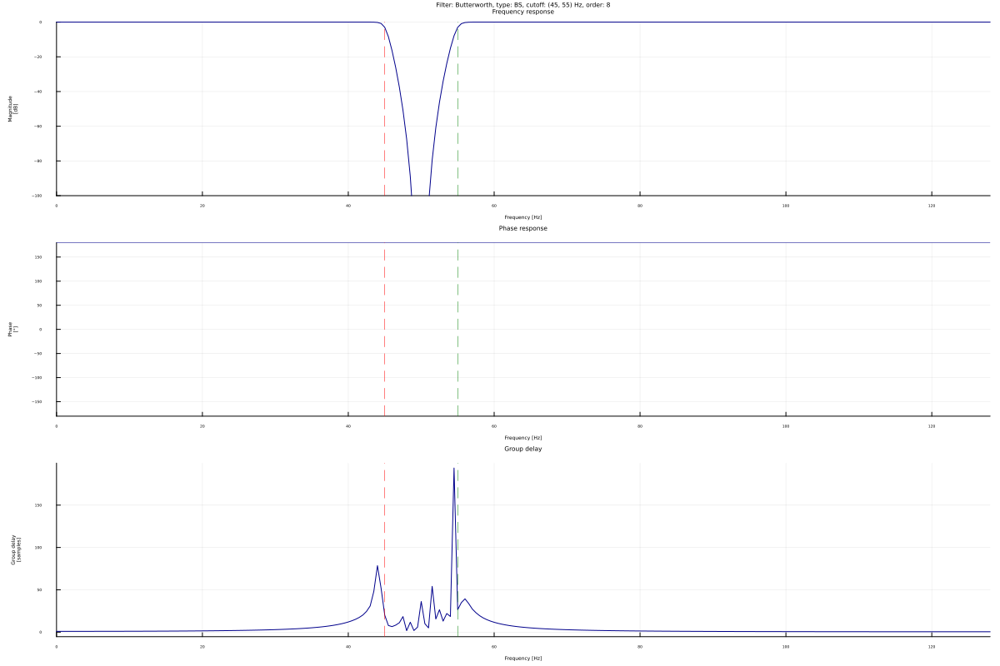

Plot band power:
```julia
p = eeg_plot_bands(edf, channel=1, type=:abs)
eeg_plot_save(p, file_name="images/edf_bands.png")
```

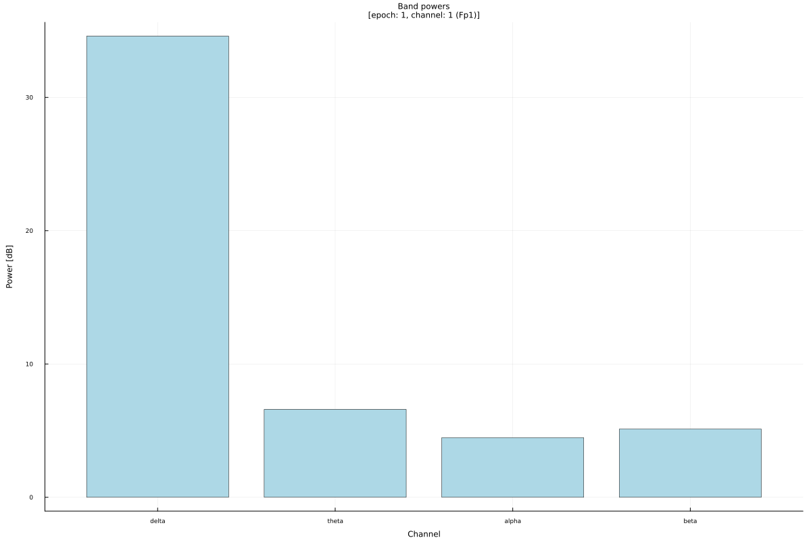

Plot spectrogram:
```julia
p = eeg_plot_signal_spectrogram(edf, channel=9, norm=true)
eeg_plot_save(p, file_name="images/edf_spec1.png")
```

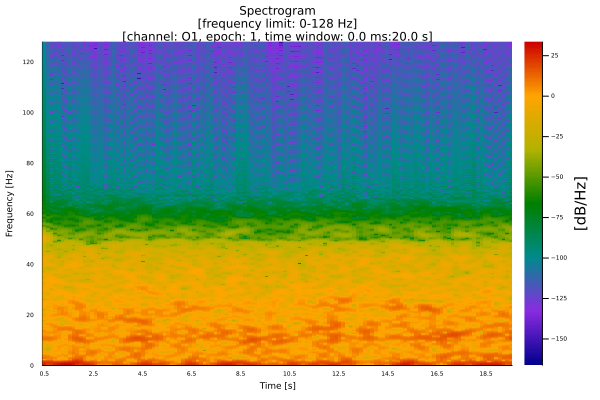

Plot multi-channel spectrogram:
```julia
p = eeg_plot_signal_spectrogram(edf, channel=1:19, len=1024, norm=true, frq_lim=(0, 50))
eeg_plot_save(p, file_name="images/edf_spec2.png")
```

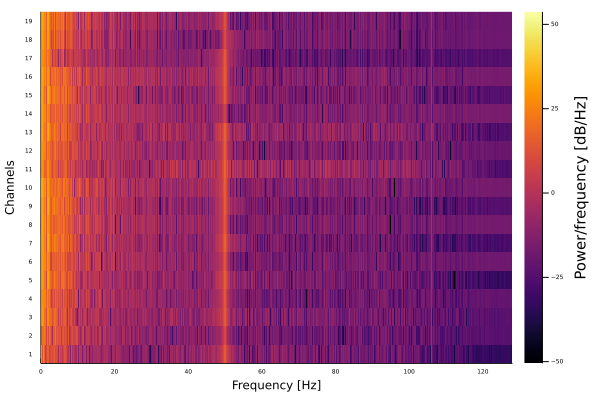

Plot PSD:
```julia
p = eeg_plot_signal_psd(edf, average=true, norm=true, channel=1)
eeg_plot_save(p, file_name="images/edf_psd.png")
```

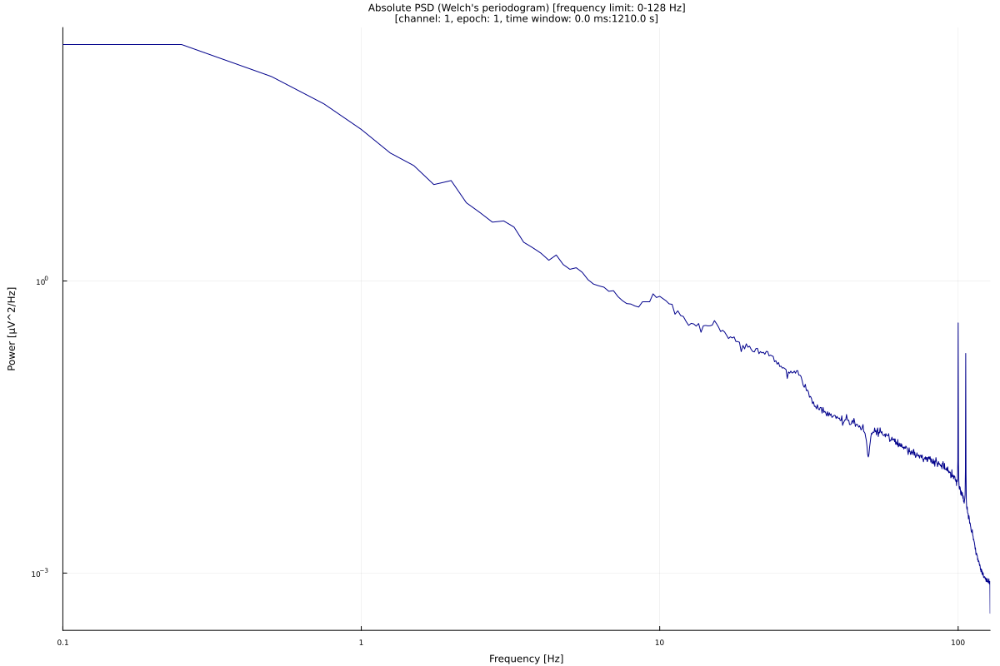

Plot PSD 3d:
```julia
p = eeg_plot_signal_psd_3d(edf, norm=true, channel=1:10)
eeg_plot_save(p, file_name="images/edf_psd_3d.png")
```
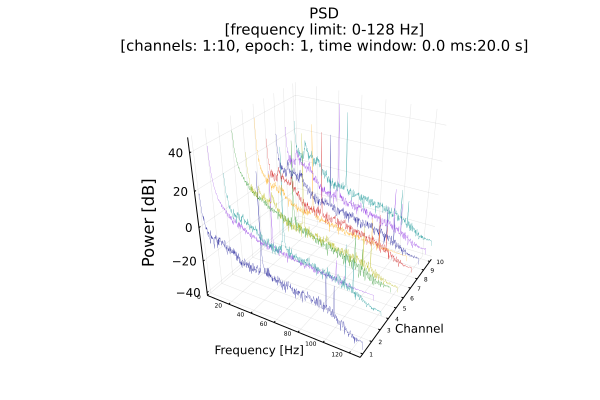

Topographical plots:
```julia
p = eeg_plot_signal_topo(edf, offset=1, len=2560, frq_lim=(0, 20))
eeg_plot_save(p, file_name="images/edf_amp.png")
```

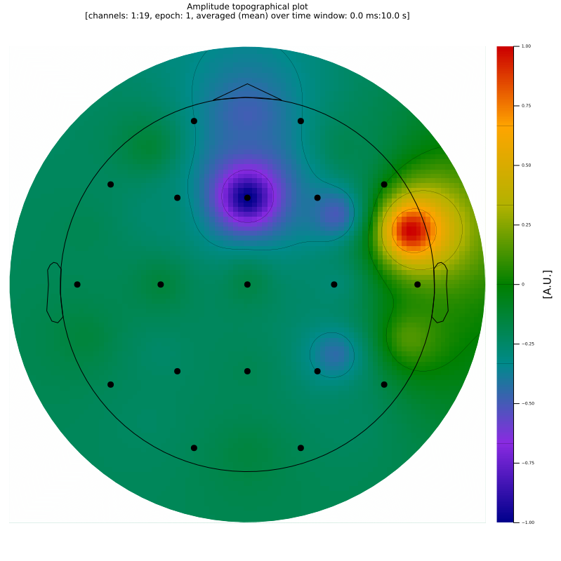

Plot PCA components:
```julia
pc, pc_m, pc_var = eeg_pca(edf, n=10)
p = eeg_plot_component_idx(edf, c=pc, c_idx=1:5, epoch=1)
eeg_plot_save(p, file_name="images/edf_pca_1_5.png")
 bar(vec(pc_var))
```

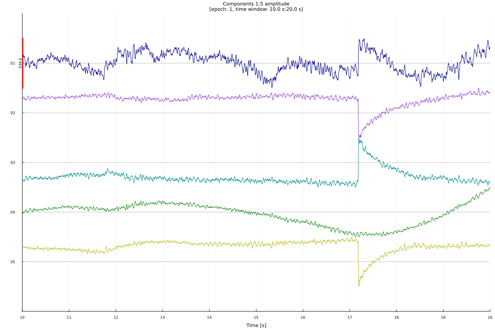

Plot ICA components:
```julia
ic, icm = eeg_ica(edf, n=16, tol=0.99)
p = eeg_plot_component_idx(edf, c=ic, c_idx=1:10, epoch=1)
eeg_plot_save(p, file_name="images/edf_ica_1_10.png")
eeg_add_component!(edf, c=:ica, v=ic)
eeg_add_component!(edf, c=:ica_mw, v=icm)
p = eeg_plot_ica_topo(edf, epoch=1, len=256, ic=1:8)
eeg_plot_save(p, file_name="images/edf_ica_1_8.png")
```

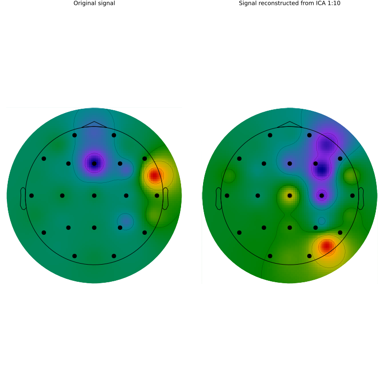

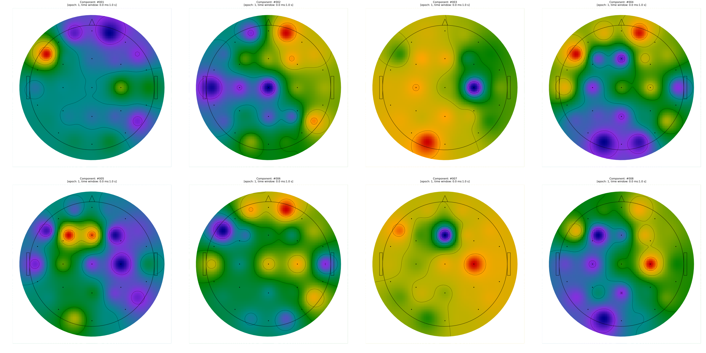

Plot alpha band power:
```julia
alpha_power = eeg_band_power(edf, f=eeg_band(edf, band=:alpha))
p = eeg_plot_mcomponent_topo(edf, epoch=1, c=alpha_power)
eeg_plot_save(p, file_name="images/edf_alpha_topo.png")
```

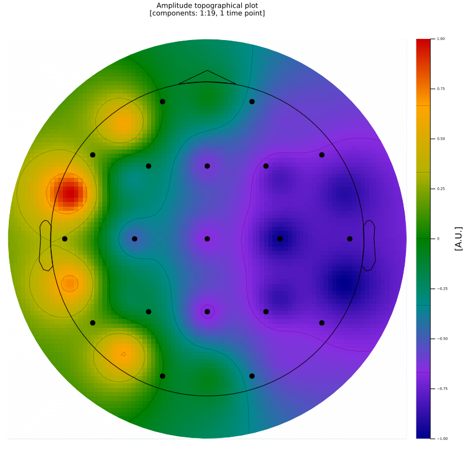

Plot covariance matrix:
```julia
edf_cov = eeg_cov(edf)
p = eeg_plot_matrix(edf, edf_cov, title="Covariance matrix")
eeg_plot_save(p, file_name="images/edf_cov.png")
```

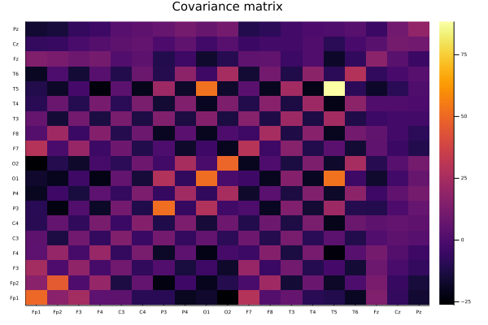

Plot autocovariance matrix:
```julia
ac, lags = eeg_autocov(edf, lag=5, norm=false)
p = eeg_plot_covmatrix(edf, ac, lags)
eeg_plot_save(p, file_name="images/edf_autocov.png")
```


Plot channels stats:
```julia
e10 = eeg_epochs(edf, epoch_n=10);
c = eeg_channels_stats(e10)
e = eeg_epochs_stats(e10)
eeg_add_component!(e10, c=:channels_var, v=c[4])
eeg_add_component!(e10, c=:epochs_var, v=e[4])
p = eeg_plot_channels(e10, c=:channels_var, epoch=1, title="Channels variance\n[epoch: 1]")
eeg_plot_save(p, file_name="images/e10_channels.png")
p = eeg_plot_epochs(e10, c=:epochs_var, title="Epochs variance")
eeg_plot_save(p, file_name="images/e10_epochs.png")
```

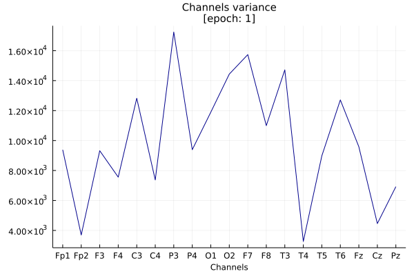

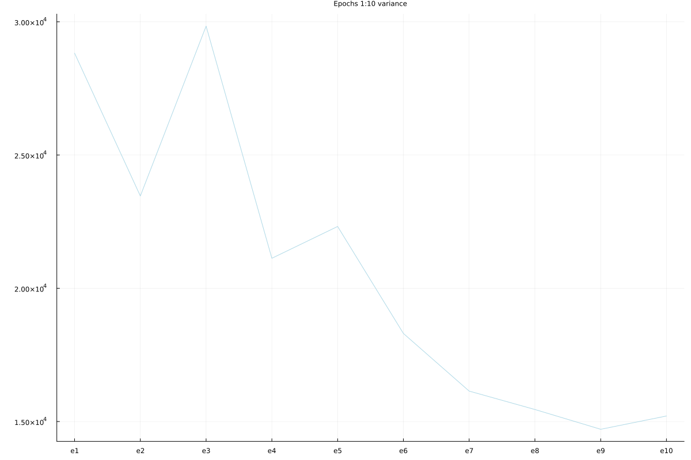

Envelopes:
```julia
p = eeg_plot_signal_psd(e10, epoch=1, channel=1)
eeg_plot_save(p, file_name="images/e10_psd.png")

p = eeg_plot_env(e10, type=:pow, average=:mean, dims=1, epoch=1, channel=1)
eeg_plot_save(p, file_name="images/e10_penv.png")

p = eeg_plot_signal_spectrogram(e10, epoch=1, channel=1, frq_lim=(0,10))
eeg_plot_save(p, file_name="images/e10_spec.png")

p = eeg_plot_env(e10, type=:spec, average=:median, epoch=1, channel=1, dims=3, frq_lim=(0,10))
eeg_plot_save(p, file_name="images/e10_senv.png")
```

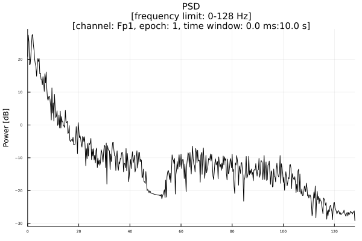

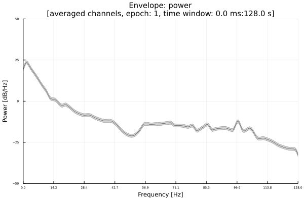

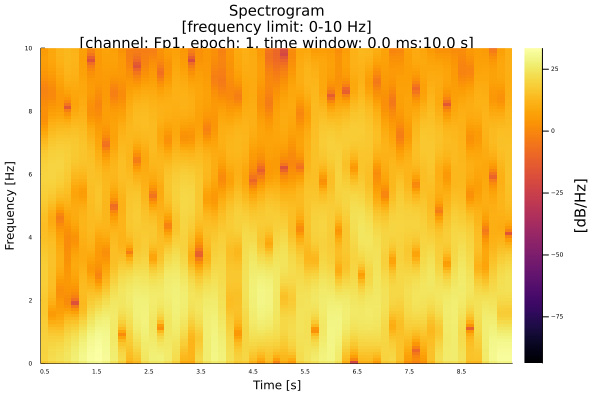

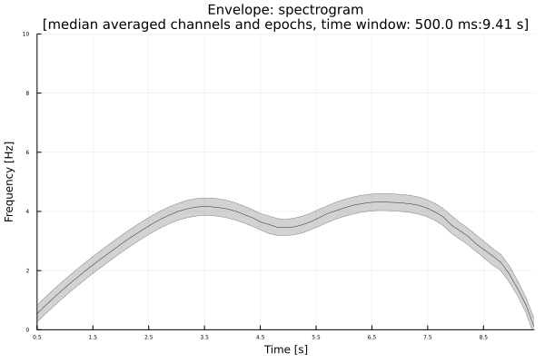

ISPC:
```julia
p = eeg_plot_ispc(e10, e10, channel1=1, channel2=2, epoch1=1, epoch2=1)
eeg_plot_save(p, file_name="images/e10_ispc.png")
m = eeg_ispc_m(e10, epoch=1)
p = eeg_plot_matrix(e10, m)
eeg_plot_save(p, file_name="images/e10_ispc_m.png")
p = eeg_plot_connections(edf, m=m, threshold=0.8, threshold_type=:geq)
eeg_plot_save(p, file_name="images/e10_ispc_connections.png")
```

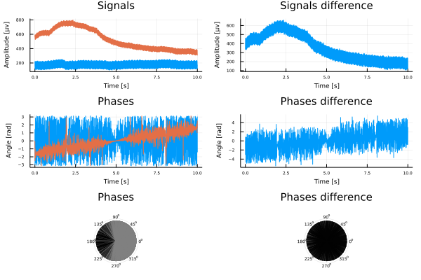

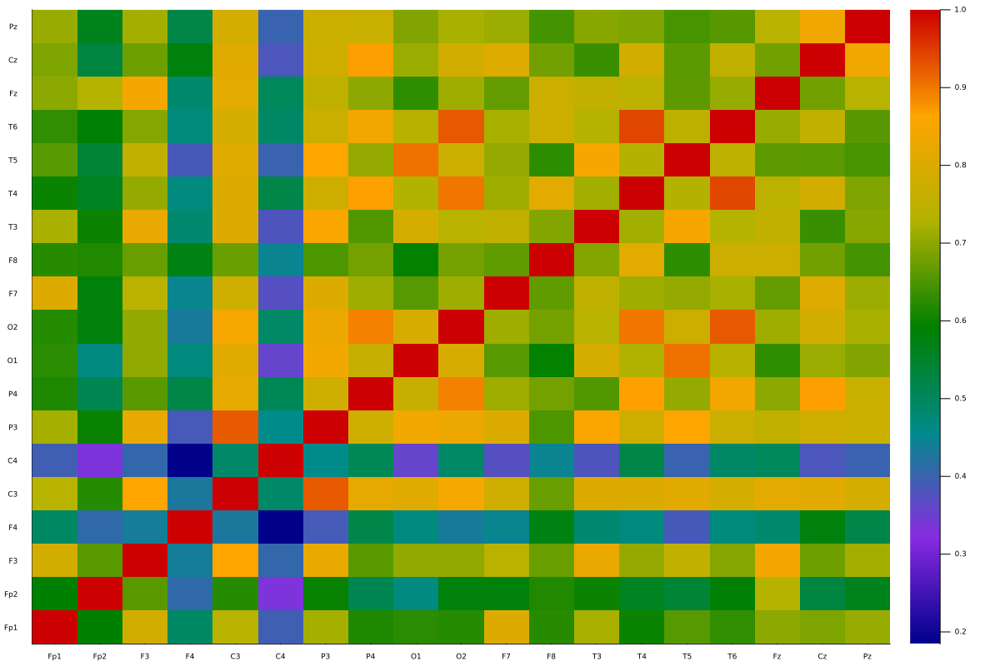

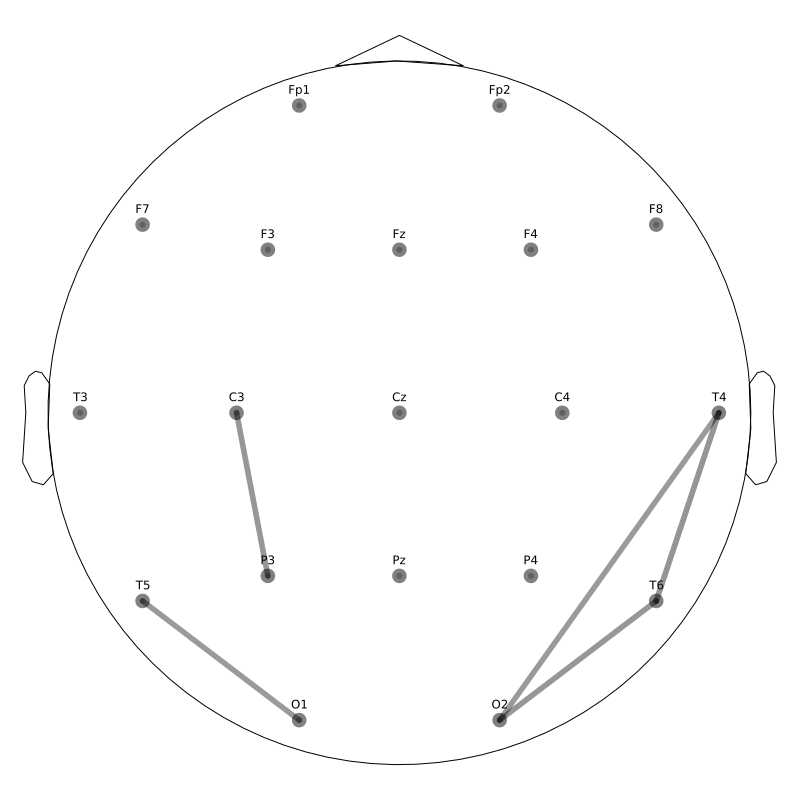

ITPC:
```julia
p = eeg_plot_itpc(e10, channel=1, t=256)
eeg_plot_save(p, file_name="images/e10_itpc.png")
p = eeg_plot_itpc_s(e10, channel=1, frq_lim=(1, 20), frq_n=20)
eeg_plot_save(p, file_name="images/e10_itpc_s.png")
i, f = eeg_itpc_s(e10, channel=1, frq_lim=(1, 20), frq_n=20)
# plot ITCP at 4 Hz frequency over epoch time
eeg_plot_itpc_f(e10, channel=1, frq_lim=(0, 10), frq_n=10, f=4, frq=:lin)
```

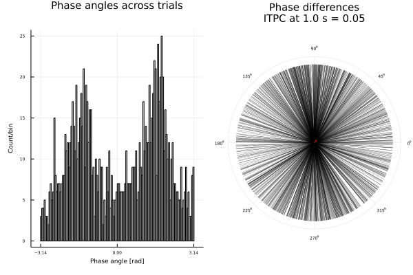

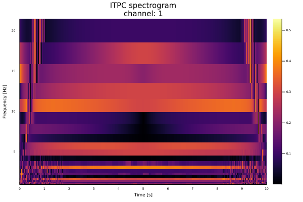

PLI:
```julia
p = eeg_plot_pli(e10, e10, channel1=1, channel2=2, epoch1=1, epoch2=1)
eeg_plot_save(p, file_name="images/e10_pli.png")
m = eeg_pli_m(e10, epoch=1)
p = eeg_plot_matrix(e10, m)
eeg_plot_save(p, file_name="images/e10_pli_m.png")
```

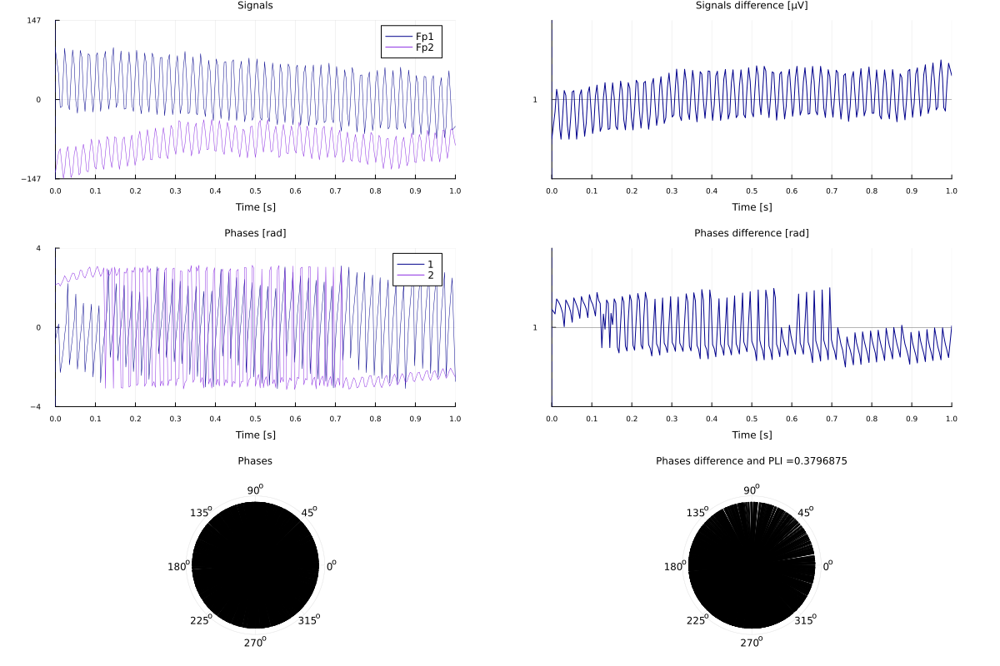

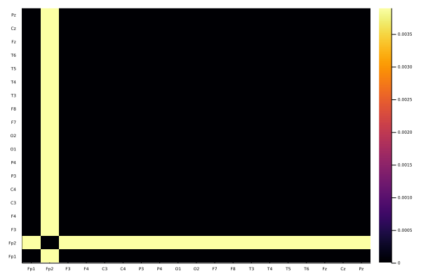

### EEG Misc

```julia
eeg_band(edf, band=:alpha)
edf = eeg_filter(edf, fprototype=:butterworth, ftype=:bp, cutoff=eeg_band(edf, band=:alpha), order=8)
hz, nyq = eeg_freqs(edf)

e = eeg_pick(edf, pick=:left)
eeg_labels(edf)[e]
e = eeg_pick(edf, pick=[:l, :f, :t])
eeg_labels(edf)[e]
```

Convert samples to seconds/seconds to samples:
```julia
eeg_s2t(edf, t=1234)
eeg_t2s(edf, t=10)
```

Mutators store results as embedded components in the EEG object:
```julia
eeg_autocov!(edf)
eeg_cor!(edf)
eeg_cov!(edf)
eeg_entropy!(edf)
eeg_freqs!(edf)
eeg_mi!(edf)
eeg_pca!(edf, n=2)
eeg_psd!(edf)
eeg_stationarity!(edf)
eeg_total_power!(edf)

eeg_ica!(edf, n=4)
eeg_component(edf, c=:ica)

eeg_epochs_stats!(edf)
eeg_component(edf, c=:epochs_mean)

eeg_info(edf)
```

# NeuroJ.jl Benchmarking

```julia
edf = eeg_import_edf("test/eeg-test-edf.edf");
ecg = eeg_extract_channel(edf, channel=24);
eeg_delete_channel!(edf, channel=24);
eog2 = eeg_extract_channel(edf, channel=23);
eeg_delete_channel!(edf, channel=23);
eog1 = eeg_extract_channel(edf, channel=22);
eeg_delete_channel!(edf, channel=22);
a2 = eeg_extract_channel(edf, channel=18);
eeg_delete_channel!(edf, channel=18);
a1 = eeg_extract_channel(edf, channel=17);
eeg_delete_channel!(edf, channel=17);
function eeg_benchmark(n::Int64)
    for idx in 1:n
        edf_new = eeg_reference_car(edf)
        e10 = eeg_epochs(edf_new, epoch_len=10*eeg_sr(edf_new))
        e10 = eeg_filter(e10, fprototype=:butterworth, ftype=:lp, cutoff=45.0, order=8)
        e10 = eeg_filter(e10, fprototype=:butterworth, ftype=:hp, cutoff=0.1, order=8)
        e10 = eeg_filter(e10, fprototype=:butterworth, ftype=:bs, cutoff=(45, 55), order=8)
        tbp = eeg_total_power(e10)
        ac = eeg_autocov(e10, norm=false)
        cc = eeg_crosscov(e10, lag=10, demean=true)
        mconv = eeg_tconv(e10, kernel=generate_morlet(256, 1, 32, complex=true))
    end
end

@time eeg_benchmark(1);
@time eeg_benchmark(1);

# workstation: 2.905986 seconds (10.25 M allocations: 22.987 GiB, 14.58% gc time)
# laptop: 4.141291 seconds (10.07 M allocations: 22.971 GiB, 8.60% gc time)
```