# Neuro.jl Tutorial

## Start NeuroAnalyzer.jl

Load package:
```julia
using NeuroAnalyzer
```

Show version (for reproducibility):
```julia
neuroanalyzer_version()
```

Get help:
```julia
?eeg_plot_signal
```

For interactive GUI, use Pluto and PlutoUI:
```julia
using Pkg
Pkg.add("Pluto")
Pkg.add("PlutoUI")
Pkg.add("Gtk")
using Pluto
Pluto.run()
```
Example Pluto notebook is located [here](https://codeberg.org/AdamWysokinski/NeuroAnalyzer.jl/src/master/docs/Notebook.jl).

For non-interactive GUI, use Jupyter:
```julia
using Pkg
Pkg.add("IJulia")
using IJulia
notebook()
```
Example Jupyter notebook is located [here](https://codeberg.org/AdamWysokinski/NeuroAnalyzer.jl/src/master/docs/Notebook.ipynb).

### EEG Edit

Remove EEG from memory:
```julia
edf = nothing
```

Copy EEG:
```julia
edf_tmp = eeg_copy(edf)
```
Do not use `edf_tmp = edf` as all operations on `edf_tmp` will also affect `edf`.

All operations on EEG are stored within the object. To show processing history:
```julia
eeg_history(edf)
```

Edit EEG header:
```julia
eeg_show_header(edf)
eeg_edit_header!(edf, field=:patient, value="N.N.")
eeg_edit_header!(edf, field=:note, value="This is a tutorial EEG dataset.")
```

Add note:
```julia
eeg_add_note!(edf, note="This is a test description.")
eeg_view_note(edf)
eeg_delete_note!(edf)
```

Show EEG properties:
```julia
eeg_info(edf)
eeg_sr(edf)
eeg_channel_n(edf)
eeg_epoch_n(edf)
eeg_signal_len(edf)
eeg_epoch_len(edf)
```

Any metadata can be extracted via `eeg_header`:
```julia
edf.eeg_header[:eeg_duration_seconds]
```

Show labels:
```julia
eeg_labels(edf)
```

Get channel (by name or number):
```julia
eeg_get_channel(edf, channel="Cz")
eeg_get_channel(edf, channel=18)
```

Rename channels:
```julia
edf = eeg_rename_channel(edf, channel="Cz", name="CZ")
eeg_rename_channel!(edf, channel=18, name="Cz")
```

Delete channels (epochs and channels may be specified using number, range or vector):
```julia
edf = eeg_delete_channel(edf, channel=1)
edf = eeg_delete_channel(edf, channel=10:18)
edf = eeg_delete_channel(edf, channel=[1, 5, 9])
edf = eeg_delete_channel(edf, channel=[1:5; 9; 10]) # note the use of ; if range is specified
```

Keep channel:
```julia
edf = eeg_keep_channel(edf, channel=1:4)
```

Replace channel 1 with channel 18:
```julia
ch = eeg_extract_channel(edf, channel=18)
edf1 = eeg_replace_channel(edf, channel=1, signal=ch)
```

Split into 10-second epochs:
```julia
e10 = eeg_epochs(edf, epoch_len=10*eeg_sr(edf))
```

Remove parts of the signal (all lengths are in samples, use `eeg_t2s()` or `time * sampling rate` to convert time to samples):
```julia
eeg_plot(e10, epoch=1)
# remove one second
eeg_trim!(e10, segment=(1, 1*eeg_sr(e10)), keep_epochs=false)

eeg_plot(e10, epoch=2)
# convert time 16.0 to 17.0 s to samples
eeg_trim!(e10, segment=(t2s(16, eeg_sr(e10)), t2s(17, eeg_sr(e10))), keep_epochs=false)
```

Get 1st epoch:
```julia
e10e1 = eeg_extract_epoch(e10, epoch=1)
eeg_info(e10e1)
```

Delete epochs:
```julia
e = eeg_delete_epoch(e10, epoch=8:10)
```

Keep epochs:
```julia
e1 = eeg_keep_epoch(e, epoch=[1, 3, 5, 9])
```

Split into 5-second averaged epoch
```julia
e2avg = eeg_epochs(edf, epoch_len=5*eeg_sr(edf), average=true)
eeg_info(e2avg)
```

Detect bad epochs:
```julia
bad_epochs = eeg_detect_bad_epochs(e10, method=[:flat, :cor], r=0.7)
eeg_check_bad_epochs(e10, bad_epochs)
eeg_delete_epoch!(e10, epoch=bad_epochs)
```

Interpolate channel (slow for long signals):
```julia
edf_new = eeg_interpolate_channel(edf, channel=1)
```

View markers:
```julia
eeg_view_markers(edf)
```

### EEG Process

Any analysis data (e.g. ICA, PCA) can be stored within the EEG object (see `eeg_add_component()`, `eeg_delete_component()`, `eeg_rename_component()`, `eeg_component_type()`) for later use (see `eeg_extract_component()`). Note: any function that changes EEG signal data (e.g. channel removal, filtering) resets embedded components (see `eeg_reset_components()`.

Show components (e.g. ICA, PCA):
```julia
eeg_list_components(edf)
```

Add component:
```julia
e = eeg_epochs_stats(edf)
eeg_add_component!(edf, c=:epoch_mean, v=e[1])
```

Get component type:
```julia
eeg_component_type(edf, c=:epoch_mean)
```

Get component content:
```julia
eeg_extract_component(edf, c=:epoch_mean)
```

Delete component:
```julia
edf = eeg_delete_component(edf, c=:ica)
eeg_delete_component!(edf, c=:ica)
eeg_reset_components!(edf)
```

Resample:
```julia
eeg_sr(edf)
edf_512 = eeg_resample(edf, new_sr=512)
edf_128 = eeg_rewnsample(edf, new_sr=128)
```

Re-reference to channel(s) - if more than one channel is used as reference, the average of these channels is used:
```julia
edf = eeg_reference_ch(edf, channel=[1, 2])
edf = eeg_reference_ch(edf, channel=2:4)
edf = eeg_reference_ch(edf, channel=18)
```

Re-reference to common average:
```julia
eeg_reference_car!(edf)
# do not include current electrode and Fp1, Fp2, O1 and O2 when calculating common average
eeg_reference_car!(edf, exclude_fpo=true, exclude_current=true)
```

Re-reference to ipsilateral auricular electrodes:
```julia
eeg_reference_a!(edf, type=:i)
```

Re-reference to contralateral mastoid electrodes:
```julia
eeg_reference_m!(edf, type=:c)
```

Re-reference using planar Laplacian, 4 adjacent electrodes:
```julia
edf_car = eeg_reference_car(edf)
p1 = eeg_plot_signal_topo(edf_car, offset=1, len=2560, frq_lim=(0, 40), title="CAR",)
edf_lap = eeg_reference_plap(edf, nn=4, weights=false)
p2 = eeg_plot_signal_topo(edf_lap, offset=1, len=2560, frq_lim=(0, 40), title="unweighted Laplacian (4)")
edf_lap = eeg_reference_plap(edf, nn=4, weights=true)
p3 = eeg_plot_signal_topo(edf_lap, offset=1, len=2560, frq_lim=(0, 40), title="weighted Laplacian (4)")
plot(p1, p2, p3, layout=(3, 1))
```

FIR filtering:
```julia
eeg_filter!(edf, fprototype=:fir, ftype=:bs, cutoff=(45, 55), order=8, window=hanning(128))
eeg_filter!(edf, fprototype=:fir, ftype=:lp, cutoff=45.0, order=8, window=hanning(128))
eeg_filter!(edf, fprototype=:fir, ftype=:hp, cutoff=0.1, order=8, window=hanning(128))
```

IIR filtering:
```julia
eeg_filter!(edf, fprototype=:butterworth, ftype=:lp, cutoff=45.0, order=8)
eeg_filter!(edf, fprototype=:butterworth, ftype=:hp, cutoff=0.1, order=8)
eeg_filter!(edf, fprototype=:butterworth, ftype=:bs, cutoff=(45, 55), order=8)
eeg_filter!(edf, fprototype=:elliptic, ftype=:bs, cutoff=(45, 55), rs=10, rp=1, order=12)
eeg_filter!(edf, fprototype=:chebyshev1, ftype=:bs, cutoff=(45, 55), rs=1, order=8)
eeg_filter!(edf, fprototype=:chebyshev2, ftype=:bs, cutoff=(45, 55), rp=1, order=8)
```

IIRNOTCH filter:
```julia
eeg_filter!(edf, fprototype=:iirnotch, cutoff=50, bw=2)
```

Remez filter:
```julia
eeg_filter!(edf, fprototype=:remez, ftype=:lp, order=128, cutoff=20, bw=0.5)
```

Normalize:
```julia
eeg_normalize!(edf, method=:zscore)
eeg_normalize!(edf, method=:minmax)
```

Remove DC:
```julia
eeg_demean(edf)
eeg_demean!(edf)
```

Taper:
```julia
eeg_taper!(edf, taper=hann(eeg_epoch_len(edf)))
```

Calculate signal derivative:
```julia
eeg_derivative(edf)
eeg_derivative!(edf)
```

Detrend:
```julia
eeg_detrend(edf, type=:linear)
eeg_detrend!(edf, type=:constant)
```

Time-domain convolution:
```julia
mw = generate_morlet(256, 1, 32, complex=true)
eeg_tconv(e10, kernel=mw)
eeg_tconv!(e10, kernel=mw)
```

Frequency-domain convolution:
```julia
mw = generate_morlet(256, 1, 32, complex=true)
eeg_fconv(e10, kernel=mw)
eeg_fconv!(e10, kernel=mw)
```

Denoising using Wiener deconvolution:
```julia
eeg_denoise_wien(edf)
```

### EEG Analyze

Calculate virtual channel:
```julia
vc = eeg_vch(edf, f="mean(fp1 + fp2) / cz")
```

Channels stats:
```julia
eeg_channels_stats(edf)
```

Calculate signal total power:
```julia
eeg_total_power(edf)
```

Calculate band power:
```julia
eeg_band_power(edf, f=(8, 12.5))
```

Calculate mean and maximum band power and frequency of maximum band power:
```julia
_, mfrq, _ = eeg_band_mpower(edf, f=eeg_band(edf, band=:alpha))
eeg_plot_channels(edf, c=mfrq, epoch=1, title="Maximum α band frequency\n[epoch: 1]")
```

Calculate covariance matrix:
```julia
eeg_cov(edf)
```

Calculate correlation matrix
```julia
eeg_cor(edf)
```

Calculate auto-covariance:
```julia
eeg_acov(edf, lag=20, norm=false)
```

Calculate cross-covariance:
```julia
cc, lags = eeg_xcov(edf, lag=20, demean=true)
# channel by channel, all combinations
plot(lags, cc[1, :])

edf1 = eeg_filter(edf, fprototype=:butterworth, ftype=:bs, cutoff=(45, 55), order=8)
edf2 = eeg_filter(edf, fprototype=:butterworth, ftype=:bs, cutoff=(45, 55), order=12)
cc, lags = eeg_xcov(edf1, edf2, channel1=1, channel2=1, epoch1=1, epoch2=1, lag=20, demean=true, norm=true)
plot(lags, cc[1, :])
```

Stationarity:
```julia
p = eeg_stationarity(edf, method=:mean)
p = eeg_stationarity(edf, method=:var)
plot(p[1, :, :], legend=false)
eeg_stationarity!(edf, method=:var)

p = eeg_stationarity(edf, method=:hilbert)
signal_mi(p[1, :, 1], p[2, :, 1])
m = eeg_mi(edf)
eeg_plot_matrix(edf, m)

plot(p[1, :, :], ylims=(-10, 10), legend=false)
p = eeg_stationarity(edf, window=100, method=:euclid)
plot(p[10:end])
```

Entropy:
```julia
e = eeg_entropy(edf)
plot(eeg_labels(edf), e, seriestype=:bar)
```

Coherence over time:
```julia
c, msc, ic = eeg_tcoherence(edf1, edf2)
plot(c[2, 1:2560, 1])
plot(ic[2, 1:2560, 1])

edf_alpha = eeg_filter(edf, fprototype=:butterworth, ftype=:bp, cutoff=eeg_band(edf, band=:alpha), order=8)
eeg_labels(edf_alpha)
# O1 vs O2
c, ic = eeg_tcoherence(edf_alpha, edf_alpha, channel1=9, channel2=10, epoch1=1, epoch2=1)
plot(c[1:2560])
plot(ic[1:2560])
```

Coherence over frequencies:
```julia
c, msc, f = eeg_fcoherence(edf, edf, channel1=[1, 2], channel2=3:4, epoch1=1, epoch2=1)
plot(f[1, :], c[1, :, 1])

# O1 vs O2, alpha range
c, msc, f = eeg_fcoherence(edf_alpha, edf_alpha, channel1=9, channel2=10, epoch1=1, epoch2=1, frq_lim=eeg_band(edf, band=:alpha))
plot(f[1, :], c[1, :, 1])
```

Generate PCA:
```julia
pc, pc_m, pc_var = eeg_pca(edf, n=4)
```

Generate ICAs:
```julia
i, i_mw = eeg_ica(edf, n=15, tol=1.0)
```

Remove ICA #001 component from the signal:
```julia
eeg_ica_reconstruct!(edf, ic=1)
```

Remove ICA #001-007 component from the signal:
```julia
eeg_ica_reconstruct!(edf, ic=1:7)
```

Remove ICA #001, 003 and 007 component from the signal:
```julia
eeg_ica_reconstruct!(edf, ic=[1, 3, 7])
```

Comparing two signals:
```julia
edf1 = eeg_filter(edf, fprototype=:butterworth, ftype=:bp, cutoff=eeg_band(edf, band=:delta), order=8)
edf1 = eeg_epochs(edf1, epoch_len=10*eeg_sr(edf1), average=true)
edf1 = eeg_keep_channel(edf1, 4)
edf2 = eeg_filter(edf, fprototype=:butterworth, ftype=:bp, cutoff=eeg_band(edf, band=:beta), order=8)
edf2 = eeg_epochs(edf2, epoch_len=10*eeg_sr(edf2), average=true)
edf2 = eeg_keep_channel(edf2, 4)
s, ss, p = eeg_difference(edf1, edf2, n=10, method=:absdiff)
s, ss, p = eeg_difference(edf1, edf2, n=10, method=:diff2int)
# the distribution of bootstrapped signal statistic
histogram(s)
# statistic for signal1 and signal2
vline!([ss])
# how many % of bootstrapped signal statistic are > statistic for signal1 and signal2
ss
# if p < alpha → signals are different
p
```

Signal stats:
```julia
m, s, v = eeg_epochs_stats(edf)
bar(v)
```

ISPC:
```julia
e10 = eeg_epochs(edf, epoch_len=10*256)
i, _, _, _, _, _ = eeg_ispc(e10, e10, channel1=1:5, channel2=6:10, epoch1=1, epoch2=1)
```

PLI:
```julia
e10 = eeg_epochs(edf, epoch_len=10*256)
p, _, _, _, _ = eeg_pli(e10, e10, channel1=1, channel2=2, epoch1=1, epoch2=1)
```

Amplitude Envelope Correlation:
```julia
aec, aec_p = eeg_aec(e10, e10, channel1=3, channel2=4, epoch1=10, epoch2=10)
```

Perform discrete wavelet transform (DWT) and continuous wavelet transform (CWT):
```julia
dwt_c = eeg_dwt(e10, wt=wavelet(WT.haar), type=:sdwt)
cwt_c = eeg_cwt(e10, wt=wavelet(Morlet(π), β=2))
```

Calculate PSD slope of the alpha band:
```julia
f, psd_slope, frq = eeg_psdslope(eeg, f=(8, 14), norm=true, mt=false)
```

### EEG Plots

Plot electrodes:

```julia
eeg_load_electrodes!(edf, file_name="locs/standard-10-20-cap19-elmiko.ced")
p = plot_electrodes(edf.eeg_locs, channel=1:19, selected=1:19, labels=true)
eeg_plot_save(p, file_name="images/edf_electrodes.png")
```


Plot multi-channel:
```julia
p = eeg_plot(edf, channel=1:19)
eeg_plot_save(p, file_name="images/edf_channels.png")
```


Plot single-channel using time-points:
```julia
p = eeg_plot(edf, channel=1, segment=(10*eeg_sr(edf), 12*eeg_sr(edf)))
eeg_plot_save(p, file_name="images/edf_channel_1_simple.png")
```


```julia
eeg_epochs!(edf, epoch_len = 2560)
p1 = eeg_plot(edf, channel=1, epoch=1)
p2 = eeg_plot_psd(edf, channel=1, epoch=1)
p3 = eeg_plot_spectrogram(edf, channel=1, epoch=1, frq_lim=(0, 40))
p4 = eeg_plot_electrodes(edf, channel=1, selected=1, labels=false)
p = plot(p1, p2, p3, p4, layout=(4, 1))
eeg_plot_save(p, file_name="images/edf_channel_1.png")
```


Plot averaged signal:
```julia
p = eeg_plot(edf, channel=1:4, mc=:mean)
eeg_plot_save(p, file_name="images/edf_avg_simple.png")
```


```julia
p = eeg_plot(edf, channel=1:8, type=:butterfly)
eeg_plot_save(p, file_name="images/edf_butterfly_simple.png")
```


```julia
p1 = eeg_plot(edf, channel=1:4, epoch=1, type=:butterfly)
p2 = eeg_plot_psd(edf, channel=1:4, epoch=1, type=:butterfly)
p3 = eeg_plot_spectrogram(edf, channel=1:4, epoch=1, frq_lim=(0, 40))
p4 = eeg_plot_electrodes(edf, channel=1:4, selected=1:4, labels=false)
p = plot(p1, p2, p3, p4, layout=(4, 1))
eeg_plot_save(p, file_name="images/edf_butterfly.png")

```


Plot filter response:
```julia
p = plot_filter_response(fs=eeg_sr(edf), fprototype=:butterworth, ftype=:bs, cutoff=(45, 55), order=8)
eeg_plot_save(p, file_name="images/butter_bs_45-55_8.png")
```


Plot band power:
```julia
using DSP
bands = [:delta, :theta, :alpha, :beta]
frq = Vector{Tuple{Float64, Float64}}()
for idx in bands
    push!(frq, eeg_band(edf, band=idx))
end
bp = Vector{Float64}()
for idx in frq
    push!(bp, pow2db.(eeg_band_power(edf, f=idx))[1])
end
p = eeg_plot_stats(edf, bp, epoch=1, channel=1, plot_by=:labels, labels=string.(bands), type=:bar, xlabel="", ylabel="Power [dB]", title="Band powers\n[epoch: 1, channel: 1 ($(eeg_labels(edf)[1]))]")
eeg_plot_save(p, file_name="images/edf_bands.png")
```


Plot spectrogram:
```julia
p = eeg_plot_spectrogram(e10, epoch=1, channel=9, norm=true)
eeg_plot_save(p, file_name="images/edf_spec1.png")
```


Plot spectrogram using wavelet convolution and variable number of Morlet-wavelet cycles:
```julia
p = eeg_plot_spectrogram(e10, epoch=1, channel=9, norm=true, method=:mw, ncyc=(2, 32))
eeg_plot_save(p, file_name="images/edf_spec2.png")
```


Plot spectrogram using STFT:
```julia
p = eeg_plot_spectrogram(e10, epoch=1, channel=9, norm=true, method=:stft)
eeg_plot_save(p, file_name="images/edf_spec4.png")
```

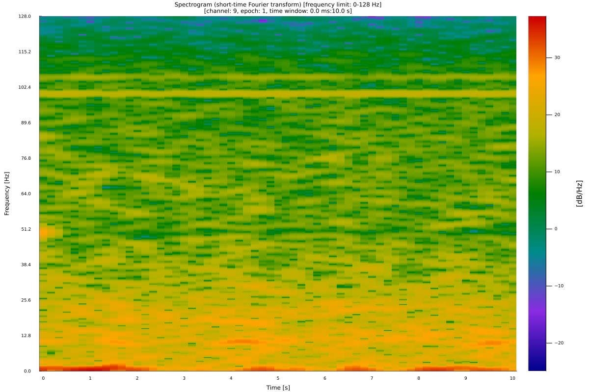

Plot multi-channel spectrogram:
```julia
p = eeg_plot_spectrogram(e10, epoch=1, channel=1:19, norm=true, frq_lim=(0, 50))
eeg_plot_save(p, file_name="images/edf_spec3.png")
```

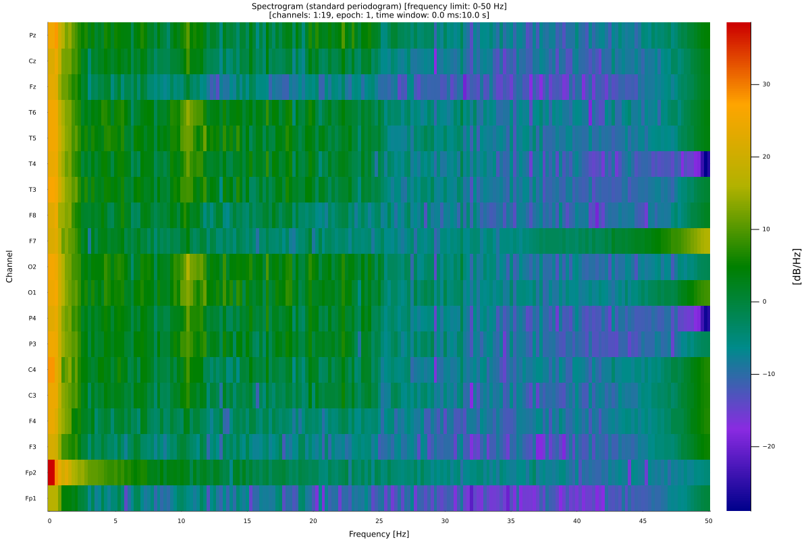

Plot PSD, x and y axes are log10-scaled:
```julia
p = eeg_plot_psd(edf, epoch=1, channel=1, norm=false, ax=:loglog)
eeg_plot_save(p, file_name="images/edf_psd.png")
```


Plot PSD relative to alpha band power:
```julia
p = eeg_plot_psd(edf, epoch=1, channel=1, ref=:alpha)
eeg_plot_save(p, file_name="images/edf_rel_psd.png")
```
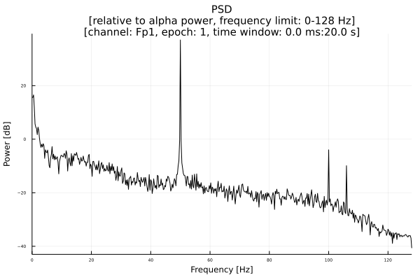

Plot phase of the convoluted signal:
```julia
mw = generate_morlet(256, 10, 32, complex=true)
e10_tconv = eeg_tconv(e10, kernel=mw)
pt = s_phases(e10_tconv)
p = eeg_plot(e10, pt, epoch=1, c_idx=1:4, scale=false, emarkers=false)
eeg_plot_save(p, file_name="images/e10_tconv_phases.png")
```


Plot PSD 3d waterfall:
```julia
p = eeg_plot_psd(edf, channel=1:5, epoch=1, method=:mw, variant=:w3d)
eeg_plot_save(p, file_name="images/edf_psd3d.png")
```


Plot PSD 3d waterfall:
```julia
p = eeg_plot_psd(edf, epoch=1, channel=1:10, variant=:w3d)
eeg_plot_save(p, file_name="images/edf_psd_3d.png")
```


Plot PSD 3d surface:
```julia
p = eeg_plot_psd(edf, epoch=1, channel=1:10, variant=:s3d, psd=:mw, ncyc=(2, 32), frq_lim=(0, 45))
eeg_plot_save(p, file_name="images/edf_psd_s3d.png")
```

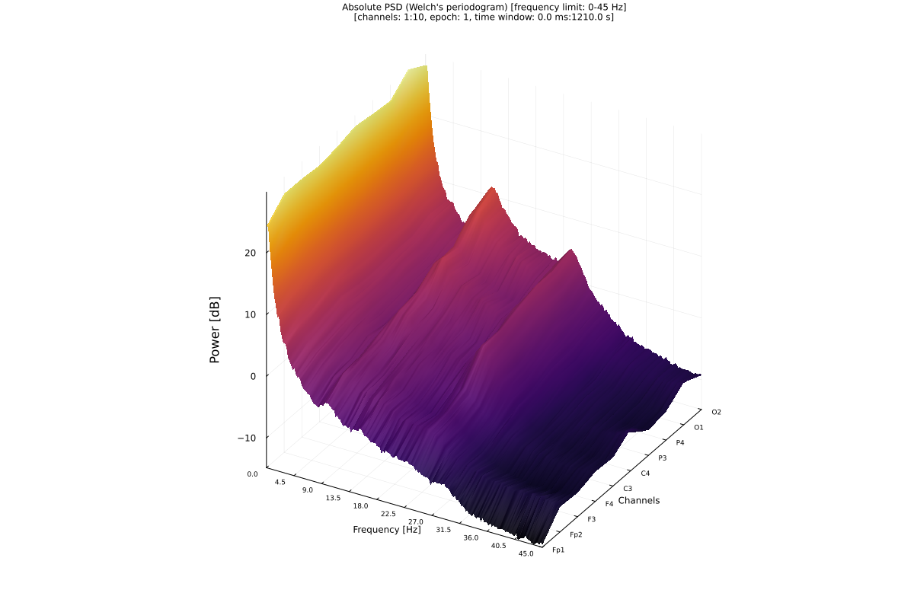

Topographical plot:
```julia
p = eeg_plot_topo(edf, segment=(1, 2560))
eeg_plot_save(p, file_name="images/edf_amp.png")
```


Topographical plots:
```
p1 = eeg_plot_topo(edf, segment=(1, 2560), title="0:1s", cb=false)
p2 = eeg_plot_topo(edf, segment=(1 * 256 + 1, 2 * 2560), title="1:2s", cb=false)
p3 = eeg_plot_topo(edf, segment=(2 * 256 + 1, 3 * 2560), title="2:3s", cb=false)
p4 = eeg_plot_topo(edf, segment=(3 * 256 + 1, 4 * 2560), title="3:4s", cb=false)
p = plot(p1, p2, p3, p4, layout=(2, 2))
eeg_plot_save(p, file_name="images/edf_topos.png")
```

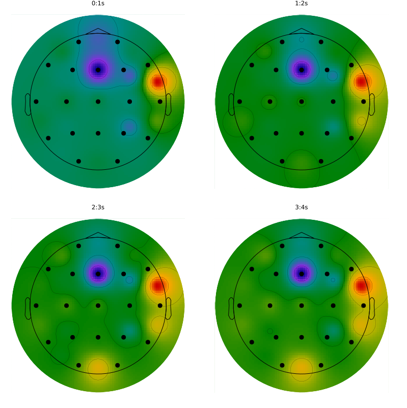

Topographical map of PSD
```julia
p = eeg_plot_psd(edf, channel=1:19, epoch=1, frq_lim=(0, 8), mt=true, variant=:topo)
eeg_plot_save(p, file_name="images/edf_psd_topo.png")
```
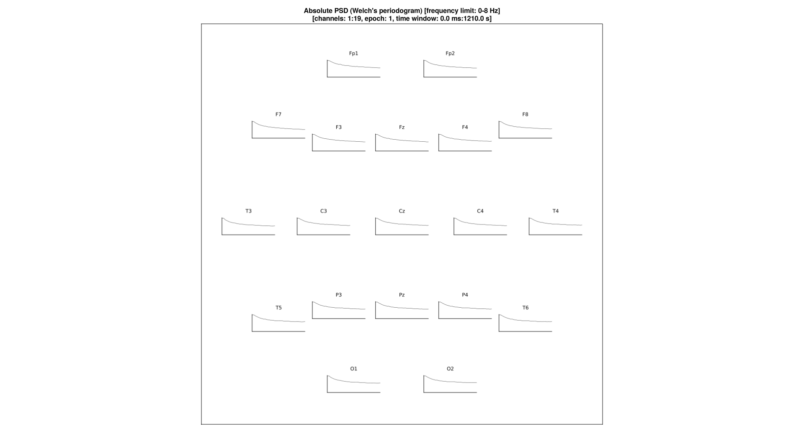

Plot PCA components:
```julia
pc, pc_m, pc_var = eeg_pca(edf, n=10)
p = eeg_plot(edf, channel=1:5, segment=(10*eeg_sr(edf), 20*eeg_sr(edf)))
eeg_plot_save(p, file_name="images/edf_1_5.png")
p = eeg_plot(edf, pc, c_idx=1:5, segment=(10*eeg_sr(edf), 20*eeg_sr(edf)))
eeg_plot_save(p, file_name="images/edf_pca_1_5.png")
bar(vec(pc_var))
```

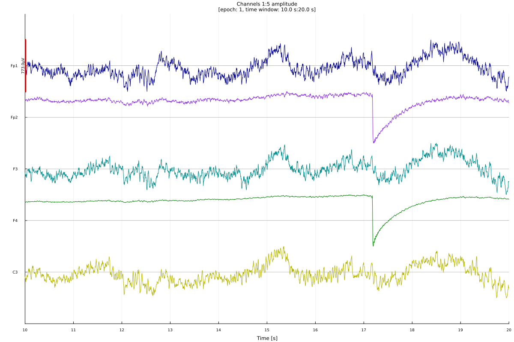


Plot ICA components:
```julia
ic, icm = eeg_ica(edf, n=16, tol=0.99)
p = eeg_plot(edf, ic, c_idx=1:10, epoch=1)
eeg_plot_save(p, file_name="images/edf_ica_1_10.png")
```


```julia
ic, icm = eeg_ica(edf, n=16, tol=0.99)
eeg_add_component!(edf, c=:ica, v=ic)
eeg_add_component!(edf, c=:ica_mw, v=icm)
# reconstruct signal using ICA 1:10
s_reconstructed = s_ica_reconstruct(edf.eeg_signals, ic=ic, ic_mw=icm, ic_v=1:10)
p1 = eeg_plot_topo(edf, epoch=1, title="Original signal", cb=false)
p2 = eeg_plot_topo(edf, s_reconstructed, epoch=1, title="Signal reconstructed from ICA 1:10", cb=false)
p = plot(p1, p2)
eeg_plot_save(p, file_name="images/edf_ica_1_10.png")
```


Plot alpha band power:
```julia
alpha_power = eeg_band_power(edf, f=eeg_band(edf, band=:alpha))
p = eeg_plot_topo(edf, alpha_power)
eeg_plot_save(p, file_name="images/edf_alpha_topo.png")
```


Plot phase difference at time = 1s (sample = 256 as fs = 256 Hz)
```julia
pdiff = eeg_phdiff(edf)
p = eeg_plot_topo(edf, pdiff[:, 256, :])
eeg_plot_save(p, file_name="images/edf_phdiff_topo.png")
```
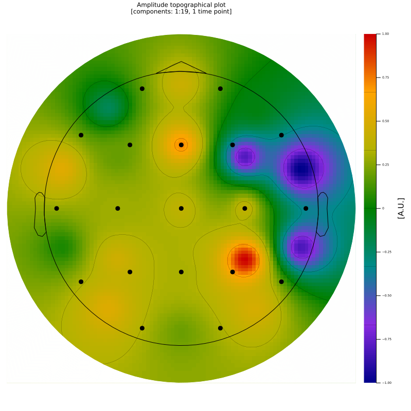

Plot amp difference at time = 1s (sample = 256 as fs = 256 Hz)
```julia
ampdiff = eeg_ampdiff(edf)
p = eeg_plot_topo(edf, ampdiff[:, 256, :], epoch=1)
eeg_plot_save(p, file_name="images/edf_ampdiff_topo.png")
```
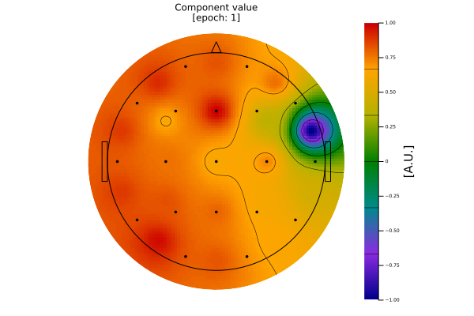

Plot weights:
```julia
w = (1:19) * 0.05
p = plot_weights(edf.eeg_locs, channel=1:19, weights=round.(w, digits=2), head_labels=false)
eeg_plot_save(p, file_name="images/edf_weights.png")
```

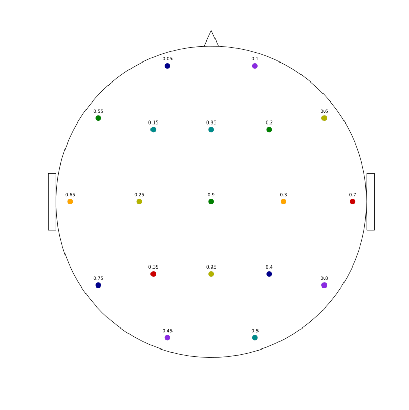

Plot covariance matrix:
```julia
edf_cov = eeg_cov(edf)
p = plot_matrix(edf_cov[:, :, 1], title="Covariance matrix", labels_x=eeg_labels(edf)[1:19], labels_y=eeg_labels(edf)[1:19])
eeg_plot_save(p, file_name="images/edf_cov.png")
```


Plot auto-covariance matrix:
```julia
ac, lags = eeg_acov(edf, lag=5, norm=false)
p = plot_covmatrix(ac[1, :, 1], lags, xlabel="", title=eeg_labels(edf)[eeg_channel_idx(edf, type=Symbol(edf.eeg_header[:signal_type]))][1])
eeg_plot_save(p, file_name="images/edf_autocov.png")
```


Plot cross-covariance matrix:
```julia
xc, lags = eeg_xcov(edf, lag=5, norm=false)
p = plot_covmatrix(xc[2, :, 1], lags, xlabel="", title="Fp1-Fp2")
eeg_plot_save(p, file_name="images/edf_xcov.png")
```

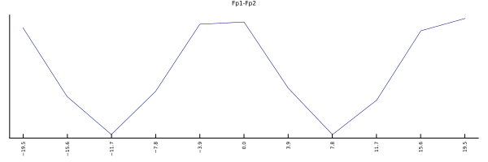

Plot channels stats:
```julia
c = eeg_channels_stats(edf)
e = eeg_epochs_stats(edf)
eeg_add_component!(edf, c=:channels_var, v=c[4])
eeg_add_component!(edf, c=:epochs_var, v=e[4])
p = eeg_plot_stats(edf, :channels_var, epoch=1, title="Channels variance\n[epoch: 1]", plot_by=:channels, type=:line)
eeg_plot_save(p, file_name="images/edf_channels.png")
p = eeg_plot_stats(edf, :epochs_var, epoch=1:10, title="Epochs 1:10 variance", plot_by=:epochs, type=:line)
eeg_plot_save(p, file_name="images/e10_epochs.png")
```


Envelopes:
```julia
p = eeg_plot_signal_psd(e10, epoch=1, channel=1)
eeg_plot_save(p, file_name="images/e10_psd.png")

p = eeg_plot_env(e10, type=:pow, average=:mean, dims=1, epoch=1, channel=1)
eeg_plot_save(p, file_name="images/e10_penv.png")

p = eeg_plot_signal_spectrogram(e10, epoch=1, channel=1, frq_lim=(0,10))
eeg_plot_save(p, file_name="images/e10_spec.png")

p = eeg_plot_env(e10, type=:spec, average=:median, epoch=1, channel=1, dims=3, frq_lim=(0,10))
eeg_plot_save(p, file_name="images/e10_senv.png")

p = eeg_plot_env(e10, type=:hamp, average=:median, epoch=1, channel=1, dims=3)
eeg_plot_save(p, file_name="images/e10_henv.png")
```


ISPC:
```julia
p = eeg_plot_ispc(e10, e10, channel1=1, channel2=2, epoch1=1, epoch2=1)
eeg_plot_save(p, file_name="images/e10_ispc.png")
m = eeg_ispc(e10)
p = plot_matrix(m[:, :, 1], labels_x=eeg_labels(e10), labels_y=eeg_labels(e10))
eeg_plot_save(p, file_name="images/e10_ispc_m.png")
p = eeg_plot_connections(e10, m=m[:, :, 1], threshold=0.90, threshold_type=:geq)
eeg_plot_save(p, file_name="images/e10_ispc_connections.png")
```


ITPC:
```julia
p = eeg_plot_itpc(e10, channel=1, t=256)
eeg_plot_save(p, file_name="images/e10_itpc.png")
p = eeg_plot_itpc_s(e10, channel=1, frq_lim=(1, 20), frq_n=20)
eeg_plot_save(p, file_name="images/e10_itpc_s.png")
i, f = eeg_itpc_s(e10, channel=1, frq_lim=(1, 20), frq_n=20)
# plot ITCP at 4 Hz frequency over epoch time
eeg_plot_itpc_f(e10, channel=1, frq_lim=(0, 10), frq_n=10, f=4, frq=:lin)
```


PLI:
```julia
p = eeg_pli(e10, e10, channel1=1, channel2=2, epoch1=1, epoch2=1)
p1 = eeg_plot(e10, segment=(1, 256), channel=1:2, variant=:butterfly, title="Signals")
p2 = eeg_plot(e10, p.signal_diff, segment=(1, 256), title="Signals difference [μV]", scale=false)
p3 = eeg_plot(e10, [p.s1_phase; p.s2_phase], segment=(1, 256), channel=1:2, variant=:butterfly, title="Phases [rad]")
p4 = eeg_plot(e10, p.phase_dif, segment=(1, 256), channel=1:2, title="Phases difference [rad]", scale=false)
p5 = eeg_plot_stats(e10, hcat(p.s1_phase[1, :, 1], ones(length(p.s1_phase[:, :, 1]))), plot_by=:channels, channel=1:2, type=:polar, title="Phases")
p6 = eeg_plot_stats(e10, hcat(p.phase_dif[1, :, 1], ones(length(p.s1_phase[:, :, 1]))), plot_by=:channels, channel=1:2, type=:polar, title="Phases difference and PLI = $(p.pli[1])")
p = plot(p1, p2, p3, p4, p5, p6, layout=(3, 2))
eeg_plot_save(p, file_name="images/e10_pli.png")

m = eeg_pli(e10)
p = plot_matrix(m[:, :, 1], labels_x=eeg_labels(e10), labels_y=eeg_labels(e10))
eeg_plot_save(p, file_name="images/e10_pli_m.png")
```


Connections based on Hilbert transform amplitude envelope:
```julia
h, t = eeg_henv(edf)
m = zeros(size(h, 1), size(h, 1))
for idx1 in 1:size(h, 1)
    for idx2 in 1:size(h, 1)
        c = s2_cor(h[idx1, :, 1], h[idx2, :, 1])
        m[idx1, idx2] = c.r
    end
end
p = eeg_plot_connections(edf, m=m, threshold=0.2, threshold_type=:geq)
eeg_plot_save(p, file_name="images/h_connections.png")
```


Animate:
```julia
anim = @animate for i ∈ 1::10:2*eeg_sr(edf)
    eeg_plot_topo(edf, segment=(2560 + i, 2560 + i + 1), channel=1:19)
end
gif(anim, "/tmp/anim_fps15.gif", fps = 15)
```

Using kwargs:
```julia
c = rand(-pi:0.01:pi, 100)
p = eeg_plot_stats(edf, c, plot_by=:epochs, epoch=1, type=:hist)
p = plot!(title="Phases in radians", xticks=([-pi, pi], ["-π", "π"]))
eeg_plot_save(p, file_name="images/kwargs.png")
```


### Statistics

Generate spectrogram segments:
```julia
sp, sf, st = eeg_spectrogram(e10) 
segp1, segs1, tidx1, fidx1 = s_specseg(sp, st, sf, channel=1, t=(1.0, 4.0), f=(10.0, 20.0))
segp2, segs2, tidx2, fidx2 = s_specseg(sp, st, sf, channel=1, t=(5.0, 8.0), f=(45.0, 55.0))

p = eeg_plot_spectrogram(e10, channel=1, epoch=1)
p = plot!(segs1, lc=:black, fill=nothing, label=false)
p = plot!(segs2, lc=:white, fill=nothing, label=false)
eeg_plot_save(p, file_name="images/spec_seg.png")

segp1 = seg_mean(segp1)
segp2 = seg_mean(segp2)
tt, t, c, df, p = s2_cmp(segp1, segp2, paired=true, type=:p);
println("segment 1: mean $(round(mean(segp1), digits=2)), sd $(round(std(segp1), digits=2))")
println("segment 2: mean $(round(mean(segp2), digits=2)), sd $(round(std(segp2), digits=2))")
println("test statistic $(t[2]): $(t[1]) (df = $df), p: $p")
p = boxplot([segp1, segp1], xticks=([1, 2], ["segment 1", "segment 2"]), legend=false, outliers=false)
segp = _labeled_matrix2dict(["segment 1", "segment 2"], [segp1, segp2])
p = eeg_plot_stats(e10, segp, plot_by=:labels, type=:box, title="Mean power [dB]", outliers=false)
eeg_plot_save(p, file_name="images/spec_seg_box.png")
```


### Pipelines

Pipelines are stored in `~/NeuroAnalyzer/pipelines`.

```julia
include("$(homedir())/NeuroAnalyzer/pipelines/test_pipeline.jl")
edf2 = test_pipeline(edf)
```

### Study

Create study object:
```julia
edf1 = eeg_filter(edf, fprototype=:butterworth, ftype=:bs, cutoff=(45, 55), order=4)
edf2 = eeg_filter(edf, fprototype=:butterworth, ftype=:bs, cutoff=(45, 55), order=8)
edf3 = eeg_filter(edf, fprototype=:butterworth, ftype=:bs, cutoff=(45, 55), order=12)
my_study = eeg_study_create([edf1, edf2, edf3], [:g1, :g2, :g3])
my_study.study_eeg[1].eeg_signals
```

### EEG Misc

Any external formula/operation/function may be applied to EEG signal using `eeg_apply()` function:
```julia
eeg_apply(edf, f="mean(eeg, dims=1)", channel=1:4)
```
`eeg` indicates EEG signal channels. Function `f` will be applied to all channels indicated by `channel` (default is all EEG/MEG channels).

Using band names and picks:
```julia
eeg_band(edf, band=:alpha)
edf = eeg_filter(edf, fprototype=:butterworth, ftype=:bp, cutoff=eeg_band(edf, band=:alpha), order=8)
hz, nyq = eeg_freqs(edf)

e = eeg_pick(edf, pick=:left)
eeg_labels(edf)[e]
e = eeg_pick(edf, pick=[:l, :f, :t])
eeg_labels(edf)[e]
```

Convert samples to seconds/seconds to samples:
```julia
eeg_s2t(edf, t=1234)
eeg_t2s(edf, t=10)
```